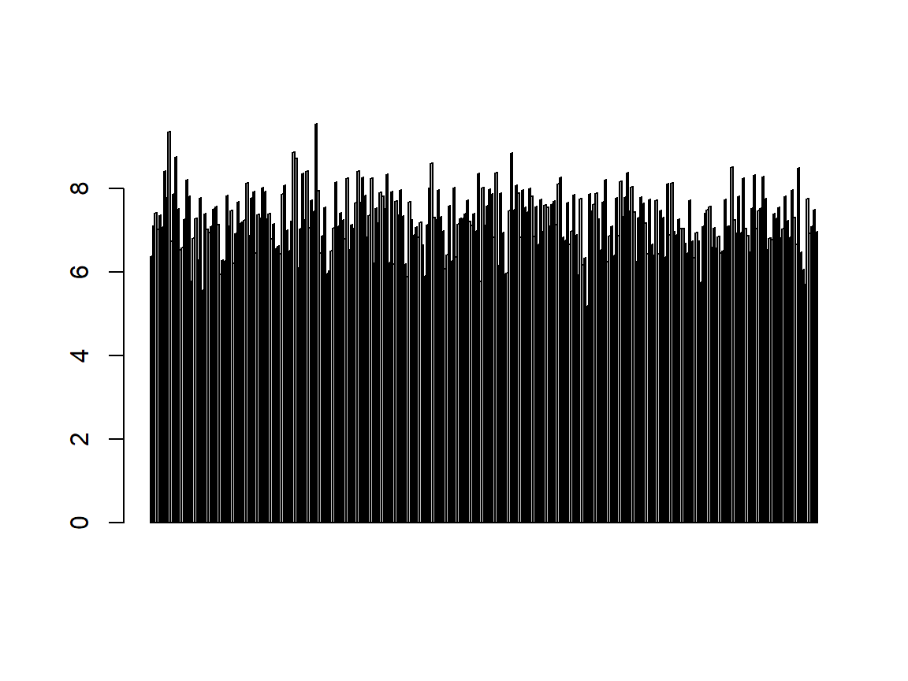
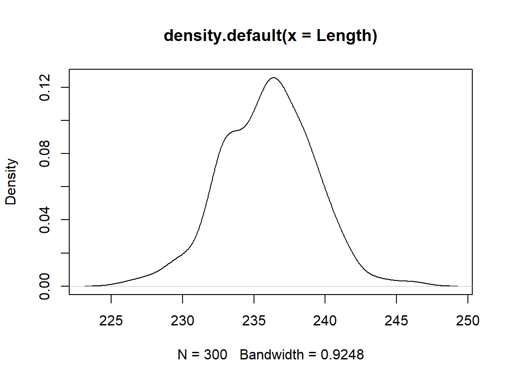

 


## Theory
These are the solutions to the exercises contained within the handout to A Primer For Statistical Tests which walks you through the basics of variables, their scales and distributions. Keep in mind that there is probably a myriad of other ways to reach the same conclusions as presented in these solutions.

I have prepared some I have prepared some   Lecture Slides  for this session.

## Data
Find the data for this exercise  here.

## Loading the `R` Environment Object 

```r
load("Data/Primer.RData")  # load data file from Data folder
```

## Variables
### Finding Variables 

```r
ls()  # list all elements in working environment
```

```
## [1] "Colour"               "Depth"                "IndividualsPassingBy"
## [4] "Length"               "Reproducing"          "Sex"                 
## [7] "Size"                 "Temperature"
```
### `Colour`

```r
class(Colour)  # mode
```

```
## [1] "character"
```

```r
barplot(table(Colour))  # fitting?
```


| Question | Answer |
|-----:|:----|
| Mode? | character |
| Which scale? | Nominal |
| What's implied? | Categorical data that can't be ordered |
| Does data fit scale? | Yes |


### `Depth` 

```r
class(Depth)  # mode
```

```
## [1] "numeric"
```

```r
barplot(Depth)  # fitting?
```


| Question | Answer |
|-----:|:----|
| Mode? | numeric |
| Which scale? | Interval/Discrete |
| What's implied? | Continuous data with a non-absence point of origin |
| Does data fit scale? | Debatable (is 0 depth absence of depth?) |


### `IndividualsPassingBy` 

```r
class(IndividualsPassingBy)  # mode
```

```
## [1] "integer"
```

```r
barplot(IndividualsPassingBy)  # fitting?
```


| Question | Answer |
|-----:|:----|
| Mode? | integer |
| Which scale? | Integer |
| What's implied? | Only integer numbers with an absence point of origin |
| Does data fit scale? | Yes |


### `Length` 

```r
class(Length)  # mode
```

```
## [1] "numeric"
```

```r
barplot(Length)  # fitting?
```


| Question | Answer |
|-----:|:----|
| Mode? | numeric |
| Which scale? | Relation/Ratio |
| What's implied? | Continuous data with an absence point of origin |
| Does data fit scale? | Yes |


### `Reproducing` 

```r
class(Reproducing)  # mode
```

```
## [1] "integer"
```

```r
barplot(Reproducing)  # fitting?
```


| Question | Answer |
|-----:|:----|
| Mode? | integer |
| Which scale? | Integer |
| What's implied? | Only integer numbers with an absence point of origin |
| Does data fit scale? | Yes |


### `Sex`

```r
class(Sex)  # mode
```

```
## [1] "factor"
```

```r
barplot(table(Sex))  # fitting?
```


| Question | Answer |
|-----:|:----|
| Mode? | factor |
| Which scale? | Binary |
| What's implied? | Only two possible outcomes |
| Does data fit scale? | Yes |


### `Size` 

```r
class(Size)  # mode
```

```
## [1] "character"
```

```r
barplot(table(Size))  # fitting?
```


| Question | Answer |
|-----:|:----|
| Mode? | character |
| Which scale? | Ordinal |
| What's implied? | Categorical data that can be ordered |
| Does data fit scale? | Yes |


### `Temperature` 

```r
class(Temperature)  # mode
```

```
## [1] "numeric"
```

```r
barplot(Temperature)  # fitting?
```



| Question | Answer |
|-----:|:----|
| Mode? | numeric |
| Which scale? | Interval/Discrete |
| What's implied? | Continuous data with a non-absence point of origin |
| Does data fit scale? | Yes (the data is clearly recorded in degree Celsius) |


## Distributions

### `Length`  

```r
plot(density(Length))  # distribution plot
```



```r
shapiro.test(Length)  # normality check
```

```
## 
## 	Shapiro-Wilk normality test
## 
## data:  Length
## W = 0.99496, p-value = 0.4331
```

The data is **normal distributed**.

### `Reproducing` 

```r
plot(density(Reproducing))  # distribution
```


```r
shapiro.test(Reproducing)  # normality check
```

```
## 
## 	Shapiro-Wilk normality test
## 
## data:  Reproducing
## W = 0.98444, p-value = 0.2889
```

The data is **binomial distributed** (i.e. "How many individuals manage to reproduce") but looks **normal distributed**. The normal distribution doesn't make sense here because it implies continuity whilst the data only comes in integers.

### `IndividualsPassingBy`  

```r
plot(density(IndividualsPassingBy))  # distribution
```


```r
shapiro.test(IndividualsPassingBy)  # normality check
```

```
## 
## 	Shapiro-Wilk normality test
## 
## data:  IndividualsPassingBy
## W = 0.96905, p-value = 0.0187
```

The data is **poisson distributed** (i.e. "How many individuals pass by an observer in a given time frame?").

### `Depth` 

```r
plot(density(Depth))  # distribution
```


The data is **uniform distributed**. You don't know this distribution class from the lectures and I only wanted to confuse you with this to show you that there's much more out there than I can show in our lectures.
