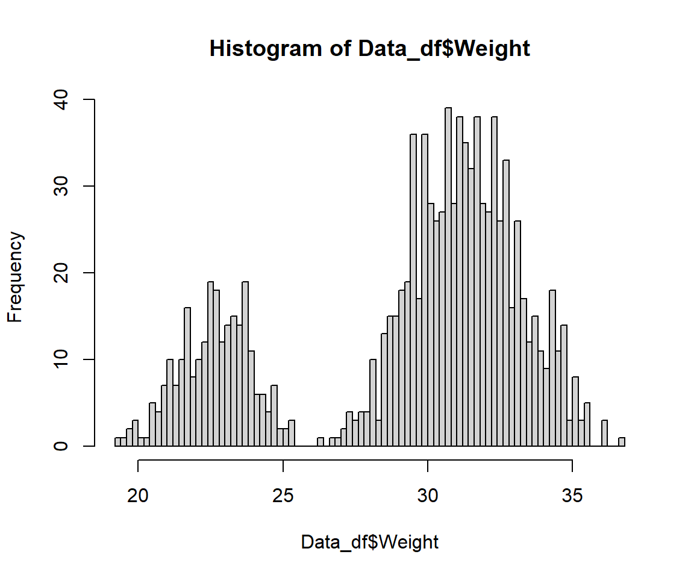

## Theory
Welcome to our first "real" practical experience in `R`. The following notes present you with an example of how data handling (also known as data cleaning) can be done. Obviously, the possibility for flaws to occur in any given data set are seemingly endless and so the following, tedious procedure should be thought of as less of an recipe of how to fix common flaws in biological data sets but make you aware of how important proper data collection and data entry is.

I have prepared some  Lecture Slides  for this session.

## Data
Find the data for this exercise  here.

## Preparing Our Procedure 
The following three sections are what I consider to be *essential* parts of the preamble to any `R`-based analysis. I highly recommend clearly indicating these bits in your code. 

More often than not, you will use variations of these code chunks whether you are working on data handling, data exploration or full-fledged statistical analyses.

### Necessary Steps For Reproducibility 
Reproducibility is the be-all and end-all of any statistical analysis, particularly in light of the peer-review process in life sciences. 


```r
rm(list=ls()) # clearing environment
Dir.Base <- getwd() # soft-coding our working directory
Dir.Data <- paste(Dir.Base, "Data", sep="/") # soft-coding our data directory 
```

Once you get into highly complex statistical analyses, you may wish to break up chunks of your analysis into separate documents. To ensure that remnants of an earlier analysis or analysis chunk do not influence the results of your current analysis, you may wish to *empty* `R`'s cache (*Environment*) before attempting a new analysis. This is achieved via the command `rm(list=ls())`.  

Next, you *need* to remember the importance of *soft-coding* for the sake of reproducibility. One of the worst offences to the peer-review process in `R`-based statistics is the erroneous hard-coding of the working directory. The `getwd()` function shown above solves this exact problem. However, for this workaround to function properly you need to open the code document of interest by double-clicking it within its containing folder.

When using the `xlsx` package or any *Excel*-reliant process via `R`, your code will automatically run a Java process in the background. By default the Java engine is limited as far as RAM allocation goes and tends to fail when faced with enormous data sets. The workaround `options(java.parameters = "-Xmx8g")` gets rid of this issue by allocation 8 GBs of RAM to Java.

### Packages
Packages are `R`'s way of giving you access to a seemingly infinite repository of functions.


```r
# function to load packages and install them if they haven't been installed yet
install.load.package <- function(x) {
  if (!require(x, character.only = TRUE))
    install.packages(x)
  require(x, character.only = TRUE)
}
package_vec <- c("dplyr" # we need this package to fix the most common data errors
                 )
sapply(package_vec, install.load.package)
```

```
## Loading required package: dplyr
```

```
## 
## Attaching package: 'dplyr'
```

```
## The following objects are masked from 'package:stats':
## 
##     filter, lag
```

```
## The following objects are masked from 'package:base':
## 
##     intersect, setdiff, setequal, union
```

```
## dplyr 
##  TRUE
```

Using the above function is way more sophisticated than the usual `install.packages()` + `library()` approach since it automatically detects which packages require installing and only install these thus not overwriting already installed packages.


### Loading The Data 
Loading data is crucial to any analysis in `R`. Period.  

`R` offers a plethora of approaches to data loading and you will usually be taught the `read.table()` command in basic biostatistics courses. However, I have found to prefer the functionality provided by the `xlsx` package since most data recording is taking place in Excel. As this package is dependant on the installation of Java and `RJava`, we will settle on the base `R` function `read.csv()`.


```r
# Data_df_base <- read.csv(file = paste(Dir.Data, "/SparrowData.csv", sep=""), header = TRUE)
Data_df_base <- read.csv("https://github.com/ErikKusch/Homepage/raw/master/content/courses/an-introduction-to-biostatistics/Data/SparrowData.csv", 
                         header = TRUE)
Data_df <- Data_df_base # duplicate and save initial data on a new object
```

Another trick to have up your sleeve (if your RAM enables you to act on it) is to duplicate your initial data onto a new object once loaded into `R`. This will enable you to easily remedy mistakes in data treatment without having to reload your initial data set from the data file.


## Inspecting The Data 
Once the data is loaded into `R`, you *need to inspect* it to make sure it is ready for use.

### Assessing A Data Frame in `R` 
Most, if not all, data you will ever load into `R` will be stored as a `data.frame` within `R`. Some of the most important functions for inspecting data frames ("df" in the following) in base `R` are the following four:

- `dim(df)` returns the dimensions (Rows $\times$ Columns)of the data frame
- `head(df)` returns the first 6 rows of the data frame by default (here changed to 4)
- `tail(df)` returns the last 6 rows of the data frame by default (here changed to 4)
- `View(df)` opens nearly any `R` object in a separate tab for further inspection. Since we are dealing with an enormous data set here, I will exclude this function for now to save you from printing unnecessary pages.


```r
dim(Data_df)
```

```
## [1] 1068   21
```

```r
head(Data_df, n = 4)
```

```
##   X    Site Index Latitude Longitude     Climate Population.Status Weight
## 1 1 Siberia    SI       60       100 Continental            Native  34,05
## 2 2 Siberia    SI       60       100 Continental            Native  34,86
## 3 3 Siberia    SI       60       100 Continental            Native  32,34
## 4 4 Siberia    SI       60       100 Continental            Native  34,78
##   Height Wing.Chord Colour    Sex Nesting.Site Nesting.Height Number.of.Eggs
## 1  12.87       6.67  Brown   Male         <NA>             NA             NA
## 2  13.68       6.79   Grey   Male         <NA>             NA             NA
## 3  12.66       6.64  Black Female        Shrub           35.6              1
## 4  15.09       7.00  Brown Female        Shrub          47.75              0
##   Egg.Weight Flock Home.Range Flock.Size Predator.Presence Predator.Type
## 1         NA     B      Large         16               Yes         Avian
## 2         NA     B      Large         16               Yes         Avian
## 3       3.21     C      Large         14               Yes         Avian
## 4         NA     E      Large         10               Yes         Avian
```

```r
tail(Data_df, n = 4)
```

```
##         X           Site Index Latitude Longitude Climate Population.Status
## 1065 1065 Falkland Isles    FI   -51.75    -59.17 Coastal        Introduced
## 1066 1066 Falkland Isles    FI   -51.75    -59.17 Coastal        Introduced
## 1067 1067 Falkland Isles    FI   -51.75    -59.17 Coastal        Introduced
## 1068 1068 Falkland Isles    FI   -51.75    -59.17 Coastal        Introduced
##      Weight Height Wing.Chord Colour  Sex Nesting.Site Nesting.Height
## 1065  34.25  15.26       7.04   Grey Male                            
## 1066  31.76  12.78       6.67   Grey Male                            
## 1067  31.48  12.49       6.63  Black Male                            
## 1068  31.94  12.96       6.70   Grey Male                            
##      Number.of.Eggs Egg.Weight Flock Home.Range Flock.Size Predator.Presence
## 1065                               A      Large         19               Yes
## 1066                               A      Large         19               Yes
## 1067                               C      Large         18               Yes
## 1068                               A      Large         19               Yes
##      Predator.Type
## 1065         Avian
## 1066         Avian
## 1067         Avian
## 1068         Avian
```

When having an initial look at the results of `head(Data_df)` and `tail(Data_df)` we can spot two important things:

- `NA`s in head and tail of our data set are stored differently. This is a common problem with biological data sets and we will deal with this issue extensively in the next few sections of this document.
- Due to our data loading procedure we ended up with a redundant first column that is simply showing the respective row numbers. However, this is unnecessary in `R` and so we can delete this column as seen below.


```r
Data_df <- Data_df[,-1] # eliminating the erroneous first column as it is redundant
dim(Data_df) # checking if the elimination went right
```

```
## [1] 1068   20
```

### The `Summary()` Function 
As already stated in our seminar series, the `summary()` function is *invaluable* to data exploration and data inspection. However, it is only partially applicable as it will not work flawlessly on every class of data. Examples of this are shown below.  

The weight data contained within our data frame should be numeric and thus pose no issue to the `summary()` function. However, as shown in the next section, it is currently of type character which leads the `summary()` function to work improperly.

```r
summary(Data_df$Weight)
```

```
##    Length     Class      Mode 
##      1068 character character
```

The height data within our data set, on the other hand, is stored correctly as class numeric. Thus the `summary()` function performs flawlessly.

```r
summary(Data_df$Height)
```

```
##    Min. 1st Qu.  Median    Mean 3rd Qu.    Max. 
##    1.35   13.52   14.52   15.39   16.22  135.40
```

Making data inspection more easy, one may which to automate the use of the `summary()` function. However, this only makes sense, when every data column is presenting data in the correct class type. Therefore, we will first fix the column classes and then use the `summary()` command.

## Data Cleaning Workflow 
### Identifying Problems 
Indentifying most problems in any data set you may ever encounter comes down to mostly two manifestations of inadequate data entry or handling:  

**1. Types/Classes  **  
Before even opening a data set, we should know what kind of data classes we expect for every variable (for example, height records as a `factor` don't make much sense). Problems with data/variable classes can have lasting influence on your analyses and so we need to test the class for each variable (column) individually. Before we alter any column classes, we will first need to identify columns whose classes need fixing. Doing so is as easy applying the `class()` function to the data contained within every column of our data frame separately.  
`R` offers multiple functions for this but I find the `lapply()` function to perform flawlessly as shown below. Since `lapply()` returns a `list` of class identifiers and these don't translate well to paper, I have opted to transform the list into a named character vector using the `unlist()` command. One could also use the `str()` function.

```r
unlist(lapply(Data_df, class))
```

```
##              Site             Index          Latitude         Longitude 
##       "character"       "character"         "numeric"         "numeric" 
##           Climate Population.Status            Weight            Height 
##       "character"       "character"       "character"         "numeric" 
##        Wing.Chord            Colour               Sex      Nesting.Site 
##         "numeric"       "character"       "character"       "character" 
##    Nesting.Height    Number.of.Eggs        Egg.Weight             Flock 
##       "character"       "character"       "character"       "character" 
##        Home.Range        Flock.Size Predator.Presence     Predator.Type 
##       "character"         "integer"       "character"       "character"
```
For further inspection, one may want to combine the information obtained by using the `class()` function with either the `summary()` function (for all non-numeric records) or the `hist` function (particularly useful for numeric records).

**2. Contents/Values  **  
Typos and the like will always lead to some data that simply doesn't make sense given the context of your project. Sometimes, errors like these are salvageable but doing so can be a very difficult process. Before we alter any column contents, we will first need to identify columns whose contents need fixing, however. Doing so is as easy applying an automated version of `summary()` to the data contained within every column of our data frame separately after having fixed possibly erroneous data classes.  

### Fixing The Problems 
Fixing the problems in our data sets always comes down to altering data classes, altering faulty values or removing them entirely.  
To make sure we fix all problems, we may often wish to enlist the `summary()` function as well as the `hist()` function for data inspection and visualisation.  

Before we alter any column contents, we will first need to identify columns whose contents need fixing. 

<!-- Doing so is as easy applying an automated version of `summary()` to the data contained within every column of our data frame separately which is now possible since we have fixed the column types.   -->

<!-- The code below does exactly that: -->
<!-- ```{r ColContProblems} -->
<!-- for(i in 1:dim(Data_df)[2]){ -->
<!--   print(colnames(Data_df)[i]) -->
<!--   print(summary(Data_df[,i])) -->
<!--   print("------------------------------------------------------") -->
<!-- } -->
<!-- ``` -->

<!-- There are some glaring issues her which we will address in the following sections. -->

## Our Data 
### Site
**Variable Class Expectation:** `factor` (only 11 possible values)

#### Identifying Problems 
Let's asses our Site records for our *Passer domesticus* individuals and check whether they behave as expected:

```r
class(Data_df$Site)
```

```
## [1] "character"
```

```r
summary(Data_df$Site)
```

```
##    Length     Class      Mode 
##      1068 character character
```
Indeed, they do behave just like we'd expect them to.  

#### Fixing Problems 
We don't need to fix anything here.


### Index
**Variable Class Expectation:** `factor` (only 11 possible values)

#### Identifying Problems 
Let's asses our Index records for our *Passer domesticus* individuals and check whether they behave as expected:

```r
class(Data_df$Index)
```

```
## [1] "character"
```

```r
summary(Data_df$Index)
```

```
##    Length     Class      Mode 
##      1068 character character
```
Indeed, they do behave just like we'd expect them to. Pay attention that thes shortened index numbers lign up with the numbers of site records!

#### Fixing Problems 
We don't need to fix anything here.

\newpage

### Latitude
**Variable Class Expectation:** `numeric` (Latitude is inherently continuous)

#### Identifying Problems 
Let's asses our Latitude records for our *Passer domesticus* individuals and check whether they behave as expected:

```r
class(Data_df$Latitude)
```

```
## [1] "numeric"
```

```r
table(Data_df$Latitude) # use this instead of summary due to station-dependency here
```

```
## 
## -51.75    -25  -21.1      4   10.5  17.25     31     54     55     60     70 
##     69     88     95    250    114    105     81     68     68     66     64
```
Indeed, they do behave just like we'd expect them to. 

#### Fixing Problems 
We don't need to fix anything here.


### Longitude
**Variable Class Expectation:** `numeric` (Longitude is inherently continuous)

#### Identifying Problems 
Let's asses our Longitude records for our *Passer domesticus* individuals and check whether they behave as expected:

```r
class(Data_df$Longitude)
```

```
## [1] "numeric"
```

```r
table(Data_df$Longitude) # use this instead of summary due to station-dependency here
```

```
## 
##    -97    -92    -90 -88.75    -67 -59.17    -53     -2   55.6    100    135 
##     68     81     64    105    114     69    250     68     95     66     88
```
Indeed, they do behave just like we'd expect them to. 

#### Fixing Problems 
We don't need to fix anything here.


### Climate
**Variable Class Expectation:** `factor` (three levels: coastal, semi-coastal, continental)

#### Identifying Problems 
Let's asses our Climate records for our *Passer domesticus* individuals and check whether they behave as expected:

```r
class(Data_df$Climate)
```

```
## [1] "character"
```

```r
summary(Data_df$Climate)
```

```
##    Length     Class      Mode 
##      1068 character character
```
Indeed, they do behave just like we'd expect them to. 

#### Fixing Problems 
We don't need to fix anything here.


### Population Status 
**Variable Class Expectation:** `factor` (two levels: native, introduced)

#### Identifying Problems 
Let's asses our Population Status records for our *Passer domesticus* individuals and check whether they behave as expected:

```r
class(Data_df$Population.Status)
```

```
## [1] "character"
```

```r
summary(Data_df$Population.Status)
```

```
##    Length     Class      Mode 
##      1068 character character
```
Indeed, they do behave just like we'd expect them to. 

#### Fixing Problems 
We don't need to fix anything here.


### Weight
**Variable Class Expectation:** `numeric` (weight is a continuous metric)

#### Identifying Problems 
Let's asses our Weight records for our *Passer domesticus* individuals and check whether they behave as expected:

```r
class(Data_df$Weight)
```

```
## [1] "character"
```

```r
summary(Data_df$Weight)
```

```
##    Length     Class      Mode 
##      1068 character character
```
Obviously, something is wrong.

#### Fixing Problems 
As seen above, weight records are currently stored as character which they shouldn't. So how do we fix this?

Firstly, let's try an intuitive `as.numeric()` approach which attempts to convert all values contained within a vector into numeric records.

```r
Data_df$Weight <- as.numeric(Data_df_base$Weight)
```

```
## Warning: NAs introduced by coercion
```

```r
summary(Data_df$Weight)
```

```
##    Min. 1st Qu.  Median    Mean 3rd Qu.    Max.    NA's 
##   19.38   26.34   30.38   29.40   31.87  420.00      66
```
Apparently, this didn't do the trick since weight data values (recorded in g) below 13 and above 40 are highly unlikely for *Passer domesticus*.  

Sometimes, the `as.numeric()` can be made more powerful by handing it data of class `character`. To do so, simply combine `as.numeric()` with `as.character()` as shown below.

```r
Data_df$Weight <- as.numeric(as.character(Data_df_base$Weight))
```

```
## Warning: NAs introduced by coercion
```

```r
summary(Data_df$Weight)
```

```
##    Min. 1st Qu.  Median    Mean 3rd Qu.    Max.    NA's 
##   19.38   26.34   30.38   29.40   31.87  420.00      66
```
That still didn't resolve our problem. Weight measurements were taken for all study organisms and so there shouldn't be any `NA`s and yet we find 66.  

Interestingly enough this is the exact same number as observations available for Siberia. A closer look at the data frame shows us that weight data for Siberia has been recorded with commas as decimal delimiters whilst the rest of the data set utilises dots.

Fixing this is not necessarily difficult but it is an erroneous issue for data handling which comes up often and is easy to avoid. Getting rid of the flaws is as simple as using the `gsub()` function contained within the `dplyr` package.

```r
Data_df$Weight <- as.numeric(gsub(pattern = ",", replacement = ".", x = Data_df_base$Weight))
summary(Data_df$Weight)
```

```
##    Min. 1st Qu.  Median    Mean 3rd Qu.    Max. 
##   19.38   27.90   30.63   29.69   32.24  420.00
```

There is one data record left hat exceeds the biologically viable span for body weight records of *Passer domesticus*. This data record holds the value 420. Since this is unlikely to be a simple mistake of placing the decimal delimiter in the wrong place (both 4.2 and 42 grams are also not feasible weight records for house sparrows), we have to delete the weight data record in question:

```r
Data_df$Weight[which(Data_df_base$Weight == 420)] <- NA 
summary(Data_df$Weight)
```

```
##    Min. 1st Qu.  Median    Mean 3rd Qu.    Max.    NA's 
##   19.38   27.89   30.63   29.33   32.23   36.66       1
```

```r
hist(Data_df$Weight, breaks = 100)
```


  
We finally fixed it!


### Height
**Variable Class Expectation:** `numeric` (height is a continuous metric)

#### Identifying Problems 
Let's asses our Height records for our *Passer domesticus* individuals and check whether they behave as expected:

```r
class(Data_df$Height)
```

```
## [1] "numeric"
```

```r
summary(Data_df$Height)
```

```
##    Min. 1st Qu.  Median    Mean 3rd Qu.    Max. 
##    1.35   13.52   14.52   15.39   16.22  135.40
```
Again, some of our data don't behave the way the should (a 135.4 or  1.35 cm tall sparrow are just absurd).

#### Fixing Problems 
Height (or "Length") records of *Passer domesticus* should fall roughly between 10cm and 22cm. Looking at the data which exceed these thresholds, it is apparent that these are generated simply through misplaced decimal delimiters. So we fix them as follows and use a histogram to check if it worked.  

```r
Data_df$Height[which(Data_df$Height < 10)] # decimal point placed wrong here
```

```
## [1] 1.350 1.446
```

```r
Data_df$Height[which(Data_df$Height < 10)] <- Data_df$Height[which(Data_df$Height < 10)] * 10 # FIXED IT!
Data_df$Height[which(Data_df$Height > 22)] # decimal point placed wrong here
```

```
## [1] 126.7 135.4
```

```r
Data_df$Height[which(Data_df$Height > 22)] <- Data_df$Height[which(Data_df$Height > 22)]/10 # FIXED IT!
summary(Data_df$Height)
```

```
##    Min. 1st Qu.  Median    Mean 3rd Qu.    Max. 
##   11.09   13.52   14.51   15.20   16.20   21.68
```

```r
hist(Data_df$Height, breaks = 100)
```


  
We finally fixed it!

### Wing Chord 
**Variable Class Expectation:** `numeric` (wing chord is a continuous metric)

#### Identifying Problems 
Let's asses our Wing Chord records for our *Passer domesticus* individuals and check whether they behave as expected:

```r
class(Data_df$Wing.Chord)
```

```
## [1] "numeric"
```

```r
summary(Data_df$Wing.Chord)
```

```
##    Min. 1st Qu.  Median    Mean 3rd Qu.    Max. 
##   6.410   6.840   7.050   7.337   7.400   9.000
```
Indeed, they do behave just like we'd expect them to. 

#### Fixing Problems 
We don't need to fix anything here.


### Colour
**Variable Class Expectation:** `factor` (three levels: black, grey, brown)

#### Identifying Problems 
Let's asses our Colour records for our *Passer domesticus* individuals and check whether they behave as expected:

```r
class(Data_df$Colour)
```

```
## [1] "character"
```

```r
summary(Data_df$Colour)
```

```
##    Length     Class      Mode 
##      1068 character character
```
Some of the colour records are very odd.

#### Fixing Problems 
The colour records "Bright black" and "Grey with black spots" should be "Grey". Someone clearly got too eager on the assignment of colours here. The fix is as easy as identifying the data records which are "too precise" and overwrite them with the correct assignment:

```r
Data_df$Colour[which(Data_df$Colour == "Bright black")] <- "Grey"
Data_df$Colour[which(Data_df$Colour == "Grey with black spots")] <- "Grey"
Data_df$Colour <- droplevels(factor(Data_df$Colour)) # drop unused factor levels
summary(Data_df$Colour) # FIXED IT!
```

```
## Black Brown  Grey 
##   356   298   414
```
We finally fixed it!


### Sex
**Variable Class Expectation:** `factor` (two levels: male and female)

#### Identifying Problems 
Let's asses our Climate records for our *Passer domesticus* individuals and check whether they behave as expected:

```r
class(Data_df$Sex)
```

```
## [1] "character"
```

```r
summary(Data_df$Sex)
```

```
##    Length     Class      Mode 
##      1068 character character
```
Indeed, they do behave just like we'd expect them to. 

#### Fixing Problems 
We don't need to fix anything here.

### Nesting Site 
**Variable Class Expectation:** `factor` (two levels: shrub and tree)

#### Identifying Problems 
Let's asses our Nesting Site records for our *Passer domesticus* individuals and check whether they behave as expected:

```r
class(Data_df$Nesting.Site)
```

```
## [1] "character"
```

```r
summary(Data_df$Nesting.Site)
```

```
##    Length     Class      Mode 
##      1068 character character
```

#### Fixing Problems 
One individual is recording to be nesting on the ground. This is something house sparrows don't do. Therefore, we have to assume that this individual is not even a *Passer domesticus* to begin with. 

The only way to solve this is to remove all observations pertaining to this individual:

```r
Data_df <- Data_df[-which(Data_df$Nesting.Site == "Ground"), ]
summary(Data_df$Nesting.Site)
```

```
##    Length     Class      Mode 
##      1067 character character
```
We just deleted a data record. This affects the flock size of the flock it belongs to (basically, this column contains hard-coded values) which we are going to deal with later.  
Still, there are manually entered `NA` records present which we have to get rid of. These can be fixed easily without altering column classes and simply making use of logic by indexing their dependencies on other column values. The nesting site for a data record where sex reads "Male" has to be `NA`.

```r
Data_df$Nesting.Site[which(Data_df$Sex == "Male")] <- NA 
Data_df$Nesting.Site <- droplevels(factor(Data_df$Nesting.Site)) # drop unused factor levels
summary(Data_df$Nesting.Site)# FIXED IT!
```

```
## Shrub  Tree  NA's 
##   292   231   544
```


### Nesting Height 
**Variable Class Expectation:** `numeric` (continuous records in two clusters corresponding to shrubs and trees)

#### Identifying Problems 
Let's asses our Nesting Height records for our *Passer domesticus* individuals and check whether they behave as expected:

```r
class(Data_df$Nesting.Height)
```

```
## [1] "character"
```

```r
summary(Data_df$Nesting.Height)
```

```
##    Length     Class      Mode 
##      1067 character character
```
There are obviously some issues here.


#### Fixing Problems 
Nesting height is a clear example of a variable that should be recorded as `numeric` and yet our data frame currently stores them as character.

Our first approach to fixing this, again, is using the `as.numeric()` function.

```r
summary(as.numeric(Data_df$Nesting.Height))
```

```
## Warning in summary(as.numeric(Data_df$Nesting.Height)): NAs introduced by
## coercion
```

```
##    Min. 1st Qu.  Median    Mean 3rd Qu.    Max.    NA's 
##   11.78   42.34   64.85  480.59  951.38 1950.86     544
```
Clearly, something went horribly wrong here. When taking a closer look, the number of 1s is artificially inflated. This is due to the `NA`s contained within the data set. These are currently stored as characters since they have been entered into the Excel sheet itself. The `as.numeric()` function transforms these into 1s.

One way of circumventing this issue is to combine the `as.numeric()` function with the `as.character()` function.

```r
Data_df$Nesting.Height <- as.numeric(as.character(Data_df$Nesting.Height))
```

```
## Warning: NAs introduced by coercion
```

```r
summary(Data_df$Nesting.Height)
```

```
##    Min. 1st Qu.  Median    Mean 3rd Qu.    Max.    NA's 
##   11.78   42.34   64.85  480.59  951.38 1950.86     544
```
This quite clearly fixed our problems.

<!-- As can be seen in the histograms below there are now far less erroneously small values. -->
<!-- ```{r plottingpanesNestingHeight, fig.height=2.75} -->
<!-- par(mfrow=c(1,2)) # plotting panes as 1 by 2 -->
<!-- hist(as.numeric(Data_df_base$Nesting.Height), main = "Numeric(Data)", breaks = 100) -->
<!-- hist(as.numeric(as.character(Data_df_base$Nesting.Height)), main = "Numeric(Character(Data))", breaks = 100) -->
<!-- ``` -->

### Number of Eggs 
**Variable Class Expectation:** `numeric` (no a priori knowledge of levels)

#### Identifying Problems 
Let's asses our Number of Eggs records for our *Passer domesticus* individuals and check whether they behave as expected:

```r
class(Data_df$Number.of.Eggs)
```

```
## [1] "character"
```

```r
summary(Data_df$Number.of.Eggs)
```

```
##    Length     Class      Mode 
##      1067 character character
```
One very out of the ordinary record is to be seen.

#### Fixing Problems 
Number of eggs is another variable which should be recorded as `numeric` and yet is currently stored as character.

Our first approach to fixing this, again, is using the `as.numeric()` function.

```r
summary(as.numeric(Data_df$Number.of.Eggs))
```

```
## Warning in summary(as.numeric(Data_df$Number.of.Eggs)): NAs introduced by
## coercion
```

```
##    Min. 1st Qu.  Median    Mean 3rd Qu.    Max.    NA's 
##   0.000   2.000   3.000   3.746   4.000  10.000     544
```
Again, this didn't do the trick. The number of 1s might be inflated and we expect exactly 544 (number of males) `NA`s since number of eggs have only been recorded for female house sparrows.  

We already know that improperly stored `NA` records are prone to causing an inflation of data records of value 1. We also remember that head and tail of our data frame hold different types of `NA` records. Let's find out who entered `NA`s correctly:

```r
unique(Data_df$Site[which(is.na(Data_df$Egg.Weight))])
```

```
## character(0)
```
The code above identifies the sites at which proper `NA` recording has been done. The Falkland Isle team did it right (`NA` fields in Excel were left blank). Fixing this is actually a bit more challenging and so we do the following:

```r
# make everything into characters
Data_df$Number.of.Eggs <- as.character(Data_df$Number.of.Eggs) 
# writing character NA onto actual NAs
Data_df$Number.of.Eggs[which(is.na(Data_df$Number.of.Eggs))] <- "  NA"
# make all character NAs into proper NAs
Data_df$Number.of.Eggs[Data_df$Number.of.Eggs == "  NA"] <- NA 
# make everything numeric
Data_df$Number.of.Eggs <- as.numeric(as.character(Data_df$Number.of.Eggs))
```

```
## Warning: NAs introduced by coercion
```

```r
summary(Data_df$Number.of.Eggs)
```

```
##    Min. 1st Qu.  Median    Mean 3rd Qu.    Max.    NA's 
##   0.000   2.000   3.000   3.746   4.000  10.000     544
```
We did it!

  

### Egg Weight 
**Variable Class Expectation:** `numeric` (another weight measurement that needs to be continuous)

#### Identifying Problems 
Let's asses our Egg Weight records for our *Passer domesticus* individuals and check whether they behave as expected:

```r
class(Data_df$Egg.Weight)
```

```
## [1] "character"
```

```r
summary(Data_df$Egg.Weight)
```

```
##    Length     Class      Mode 
##      1067 character character
```

#### Fixing Problems 
Egg weight should be recorded as `numeric` and yet is currently stored as character. Our first approach to fixing this, again, is using the `as.numeric()` function again.

```r
summary(as.numeric(Data_df$Egg.Weight))
```

```
## Warning in summary(as.numeric(Data_df$Egg.Weight)): NAs introduced by coercion
```

```
##    Min. 1st Qu.  Median    Mean 3rd Qu.    Max.    NA's 
##   1.580   2.340   2.670   2.619   2.890   3.590     590
```
Something is wrong here. Not enough `NA`s are recorded. We expect exactly 590 `NA`s (Number of males + Number of Females with zero eggs). Additionally, there are way too many 1s.
Our problem, again, lies with the way the `NA`s have been entered into the data set from the beginning and so we use the following fix again.

```r
# make everything into characters
Data_df$Egg.Weight <- as.character(Data_df$Egg.Weight) 
# writing character NA onto actual NAs
Data_df$Egg.Weight[which(is.na(Data_df$Egg.Weight))] <- "  NA" 
# make all character NAs into proper NAs
Data_df$Egg.Weight[Data_df$Egg.Weight == "  NA"] <- NA 
# make everything numeric
Data_df$Egg.Weight <- as.numeric(as.character(Data_df$Egg.Weight))
summary(Data_df$Egg.Weight)
```

```
##    Min. 1st Qu.  Median    Mean 3rd Qu.    Max.    NA's 
##   1.580   2.340   2.670   2.619   2.890   3.590     590
```

### Flock
**Variable Class Expectation:** `factor` (each sparrow was assigned to one particular flock)

#### Identifying Problems 
Let's asses our Flock records for our *Passer domesticus* individuals and check whether they behave as expected:

```r
class(Data_df$Flock)
```

```
## [1] "character"
```

```r
summary(Data_df$Flock)
```

```
##    Length     Class      Mode 
##      1067 character character
```
Indeed, they do behave just like we'd expect them to.  

#### Fixing Problems 
We don't need to fix anything here.


### Home Range 
**Variable Class Expectation:** `factor` (three levels: small, medium, large)

#### Identifying Problems 
Let's asses our Home Range records for our *Passer domesticus* individuals and check whether they behave as expected:

```r
class(Data_df$Home.Range)
```

```
## [1] "character"
```

```r
summary(Data_df$Home.Range)
```

```
##    Length     Class      Mode 
##      1067 character character
```
Indeed, they do behave just like we'd expect them to.  

#### Fixing Problems 
We don't need to fix anything here.


### Flock Size 
**Variable Class Expectation:** `numeric` (continuous measurement of how many sparrows are in each flock - measured as integers)

#### Identifying Problems 
Let's asses our Flock Size records for our *Passer domesticus* individuals and check whether they behave as expected:

```r
class(Data_df$Flock.Size)
```

```
## [1] "integer"
```

```r
summary(Data_df$Flock.Size)
```

```
##    Min. 1st Qu.  Median    Mean 3rd Qu.    Max. 
##    7.00   16.00   19.00   25.81   31.00   58.00
```
Indeed, they do behave just like we'd expect them to.  

#### Fixing Problems 
We don't need to fix anything here.


### Predator Presence 
**Variable Class Expectation:** `factor` (two levels: yes and no)

#### Identifying Problems 
Let's asses our Predator Presence records for our *Passer domesticus* individuals and check whether they behave as expected:

```r
class(Data_df$Predator.Presence)
```

```
## [1] "character"
```

```r
summary(Data_df$Predator.Presence)
```

```
##    Length     Class      Mode 
##      1067 character character
```
Indeed, they do behave just like we'd expect them to.  

#### Fixing Problems 
We don't need to fix anything here.


 

### Predator Type 
**Variable Class Expectation:** `factor` (three levels: Avian, Non-Avian, and `NA`)

#### Identifying Problems 
Let's asses our Predator Type records for our *Passer domesticus* individuals and check whether they behave as expected:

```r
class(Data_df$Predator.Type)
```

```
## [1] "character"
```

```r
summary(Data_df$Predator.Type)
```

```
##    Length     Class      Mode 
##      1067 character character
```
Something doesn't sit well here.

#### Fixing Problems 
Someone got overly eager when recording Predator Type and specified the presence of a hawk instead of taking down "Avian". We fix this as follows:

```r
Data_df$Predator.Type[which(Data_df$Predator.Type == "Hawk")] <- "Avian"
summary(Data_df$Predator.Type)
```

```
##    Length     Class      Mode 
##      1067 character character
```

This fixed it  but there are still manually entered `NA` records present which we have to get rid of. These can be fixed easily without altering column classes and simply making use of logic by indexing their dependencies on other column values. The predator type for a data record where predator presence reads "No" has to be `NA`.

```r
Data_df$Predator.Type[which(Data_df$Predator.Presence == "No")] <- NA 
Data_df$Predator.Type <- droplevels(factor(Data_df$Predator.Type)) # drop unused factor levels
summary(Data_df$Predator.Type)# FIXED IT!
```

```
##     Avian Non-Avian      NA's 
##       490       220       357
```


### Redundant Data 
Our data contains redundant columns (i.e.: columns whose data is present in another column already). These are (1) Flock Size (data contained in Flock column) and (2) Flock.Size (data contained in Index column). The fix to this is as easy as removing the columns in question.

```r
Data_df <- within(Data_df, rm(Flock.Size, Site))
dim(Data_df)
```

```
## [1] 1067   18
```
Fixed it!  

By doing so, we have gotten rid of our flock size problem stemming from the deletion of a data record. You could also argue that the columns `Site` and `Index` are redundant. We keep both for quality-of-life when interpreting our results (make use of `Sites`) and coding (make use os `Index`).

## Saving The Fixed Data Set 
We fixed out entire data set! The data set is now ready for use.  

Keep in mind that the data set I provided you with was relatively clean and real-world messy data sets can be far more difficult to clean up.  

Before going forth, we need to save it. **Attention:** don't overwrite your initial data file!

### Final Check 
Before exporting you may want to ensure that everything is in order and do a final round of data inspection. This can be achieved by running the automated `summary()` command from earlier again as follows. I am not including the output here to save some space.

```r
for(i in 1:dim(Data_df)[2]){
  print(colnames(Data_df)[i])
  print(summary(Data_df[,i]))
  print("------------------------------------------------------")
}
```
Everything checks out. Let's save our final data frame.

### Exporting The Altered Data 
Since Excel is readily available for viewing data outside of R, I like to save my final data set in excel format as can be seen below. Additionally, I recommend saving your final data frame as an RDS file. These are `R` specific data files which you will not be able to alter outside of `R` thus saving yourself from accidentally changing records when only trying to view your data. On top of that, RDS files take up less space than either Excel or TXT files do.

```r
# saving in excel sheet
write.csv(Data_df, file = paste(Dir.Data, "/SparrowData_FIXED.csv", sep=""))
# saving as R data frame object
saveRDS(Data_df, file = paste(Dir.Data, "/1 - Sparrow_Data_READY.rds", sep="")) 
```

