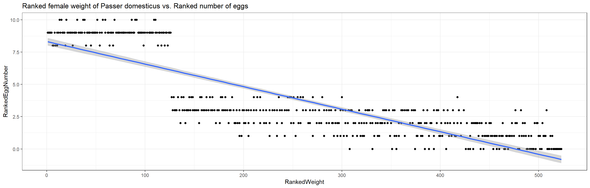
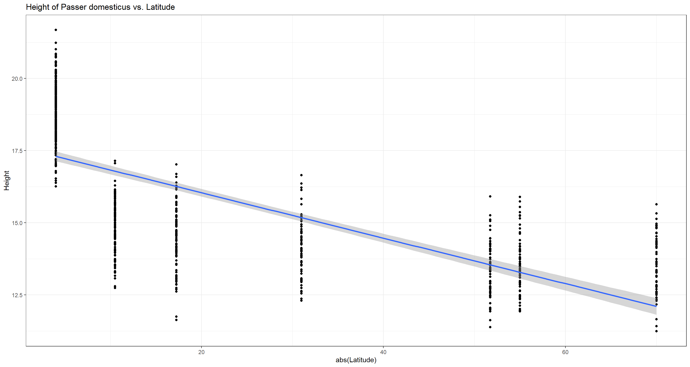

## Theory
Welcome to our third practical experience in R. Throughout the following notes, I will introduce you to a couple statistical correlation approaches that might be useful to you and are, to varying degrees, often used in biology. To do so, I will enlist the sparrow data set we handled in our first exercise.

I have prepared some  Lecture Slides  for this session.

## Data 
Find the data for this exercise  here.

## Preparing Our Procedure
To ensure others can reproduce our analysis we run the following three lines of code at the beginning of our `R` coding file.

```r
rm(list=ls()) # clearing environment
Dir.Base <- getwd() # soft-coding our working directory
Dir.Data <- paste(Dir.Base, "Data", sep="/") # soft-coding our data directory 
```


### Packages
Using the following, user-defined function, we install/load all the necessary packages into our current `R` session.

```r
# function to load packages and install them if they haven't been installed yet
install.load.package <- function(x) {
  if (!require(x, character.only = TRUE))
    install.packages(x)
  require(x, character.only = TRUE)
}
package_vec <- c("DescTools", # Needed for Contingency Coefficient
                 "ggplot2" # needed for data visualisation
                 )
sapply(package_vec, install.load.package)
```

```
## Loading required package: DescTools
```

```
## Loading required package: ggplot2
```

```
## DescTools   ggplot2 
##      TRUE      TRUE
```

### Loading Data
During our first exercise (Data Mining and Data Handling - Fixing The Sparrow Data Set) we saved our clean data set as an RDS file. To load this, we use the `readRDS()` command that comes with base `R`.

```r
Data_df_base <- readRDS(file = paste(Dir.Data, "/1 - Sparrow_Data_READY.rds", sep=""))
Data_df <- Data_df_base # duplicate and save initial data on a new object
```


## Nominal Scale - Contingency Coefficient
We can analyse correlations/dependencies of variables of the categorical kind using the contingency coefficient by calling the `ContCoef()` function of base `R`.  

Keep in mind that the contingency coefficient is not *really* a measure of correlation but merely of association of variables. A value of $c \approx 0$ indicates independent variables.

### Predation

**Are colour morphs of Passer domesticus linked to predator presence and/or predator type?**

This analysis builds on our findings within our previous exercise (Nominal Tests - Analysing The Sparrow Data Set). Remember that, using the two-sample situation Chi-Squared Test, we found no change in treatment effects (as far as colour polymorphism went) for predator type values but did so regarding the presence of predators. Let's repeat this here:

```r
table(Data_df$Colour, Data_df$Predator.Presence)
```

```
##        
##          No Yes
##   Black  64 292
##   Brown 211  87
##   Grey   82 331
```

```r
ContCoef(table(Data_df$Colour, Data_df$Predator.Presence))
```

```
## [1] 0.4421914
```


```r
table(Data_df$Colour, Data_df$Predator.Type)
```

```
##        
##         Avian Non-Avian
##   Black   197        95
##   Brown    60        27
##   Grey    233        98
```

```r
ContCoef(table(Data_df$Colour, Data_df$Predator.Type))
```

```
## [1] 0.02957682
```
Here, we find the same results as when using the Chi-Squared statistic and conclude that colour morphs of the common house sparrow are likely to be driven by predator presence but not the type of predator that is present.  

**Are nesting sites of Passer domesticus linked to predator presence and/or predator type?**

Again, following our two-sample situation Chi-Squared analysis from last exercise, we want to test whether nesting site and predator presence/predator type are linked. The Chi-Squared analyses identified a possible link of nesting site and predator type but nor predator presence.

```r
table(Data_df$Nesting.Site, Data_df$Predator.Presence)
```

```
##        
##          No Yes
##   Shrub  87 205
##   Tree   94 137
```

```r
ContCoef(table(Data_df$Nesting.Site, Data_df$Predator.Presence))
```

```
## [1] 0.1130328
```

```r
table(Data_df$Nesting.Site, Data_df$Predator.Type)
```

```
##        
##         Avian Non-Avian
##   Shrub   182        23
##   Tree     49        88
```

```r
ContCoef(table(Data_df$Nesting.Site, Data_df$Predator.Type))
```

```
## [1] 0.4851588
```
Whilst there doesn't seem to be any strong evidence linking nesting site and predator presence, predator type seems to be linked to what kind of nesting site *Passer domesticus* prefers thus supporting our Chi-Squared results.

### Sexual Dimorphism

**Are sex ratios of Passer domesticus related to climate types?**

Recall that, in our last exercise, we found no discrepancy of proportions of the sexes among the entire data set using a binomial test. What we didn't check yet was whether the sexes are distributed across the sites somewhat homogeneously or whether the sex ratios might be skewed according to climate types. Let's do this:

```r
# prepare climate type testing data
Data_df <- Data_df_base
Index <- Data_df$Index
# select all data belonging to the stations at which all parameters except for climate type are held constant
Rows <- which(Index == "SI" | Index == "UK" | Index == "RE" | Index == "AU" )
Data_df <- Data_df[Rows,]
Data_df$Climate <- droplevels(factor(Data_df$Climate))

# analysis
table(Data_df$Sex, Data_df$Climate)
```

```
##         
##          Coastal Continental
##   Female      91          76
##   Male        72          78
```

```r
ContCoef(table(Data_df$Sex, Data_df$Climate))
```

```
## [1] 0.06470702
```
Quite obviously, they aren't and, if there are any patterns in sex ratios to emerge, these are not likely to stem from climate types. Also keep in mind that we have a plethora of other variables at play whilst the information contained within the climate type variable is somewhat constrained and, in this case, bordering on uninformative (i.e. a coastal site in the Arctic might be more closely resembled by a continental mid-latitude site than by a tropical coastal site).

## Ordinal Scale - Kendall's Tau

### Climate Warming/Extremes

**Do heavier sparrows have heavier/less eggs?**

A heavier weight of individual females alludes to a higher pool of resources being allocated by said individuals. There are multiple ways they might make use of it, one of them being investment in reproduction. To test how heavier females of *Passer domesticus* utilise their resources in reproduction, we use a Kendall's Tau approach to finding links between female weight and average egg weight per nest/number of eggs per nest.  
Obviously, both weight variables are metric in nature and so we could use other methods as well. On top of that, we first need to convert these into ranks before being able to run a Kendall's Tau analysis as follows:


```r
# overwriting changes in Data_df with base data
Data_df <- Data_df_base
# Establishing Ranks of Egg Weight
RankedEggWeight <- rank(Data_df$Egg.Weight[which(Data_df$Sex == "Female")],
                        ties.method = "average")
# Establishing Ranks of Female Weight
RankedWeight_Female <- rank(Data_df$Weight[which(Data_df$Sex == "Female")],
                            ties.method = "average")
# Extracting Numbers of Eggs
RankedEggs <- Data_df$Number.of.Eggs[which(Data_df$Sex == "Female")]
```

Luckily enough, the number of eggs per nest already represent a ranked (ordinal) variable and so we can move straight on to running our analyses:

```r
# Test ranked female weight vs. ranked egg weight
cor.test(x = RankedWeight_Female, y = RankedEggWeight, 
         use = "pairwise.complete.obs", method = "kendall")
```

```
## 
## 	Kendall's rank correlation tau
## 
## data:  RankedWeight_Female and RankedEggWeight
## z = 19.771, p-value < 2.2e-16
## alternative hypothesis: true tau is not equal to 0
## sample estimates:
##       tau 
## 0.5804546
```
There is strong evidence to suggest that heavier females tend to lay heavier eggs (tau = 0.5804546 at p $\approx$ 0).


```r
# Test ranked female weight vs. number of eggs
cor.test(x = RankedWeight_Female, y = RankedEggs, 
         use = "pairwise.complete.obs", method = "kendall")
```

```
## 
## 	Kendall's rank correlation tau
## 
## data:  RankedWeight_Female and RankedEggs
## z = -21.787, p-value < 2.2e-16
## alternative hypothesis: true tau is not equal to 0
## sample estimates:
##        tau 
## -0.6880932
```
Additionally, the heavier a female of *Passer domesticus*, the less eggs she produces (tau = -0.6880932 at p $\approx$ 0). 

Now we can visualise the underlying patterns:

```r
plot_df <- data.frame(RankedWeight = RankedWeight_Female,
                      RankedEggWeight = RankedEggWeight,
                      RankedEggNumber = RankedEggs)
# plot ranked female weight vs. ranked egg weight
ggplot(data = plot_df, aes(x = RankedWeight, y = RankedEggWeight)) +
  geom_point() + theme_bw() + stat_smooth(method = "lm") + 
  labs(title = "Ranked female weight of Passer domesticus vs. Ranked weigt of eggs")
```

```
## `geom_smooth()` using formula 'y ~ x'
```


```r
# plot ranked female weight vs. number of eggs
ggplot(data = plot_df, aes(x = RankedWeight, y = RankedEggNumber)) +
  geom_point() + theme_bw() + stat_smooth(method = "lm") + 
  labs(title = "Ranked female weight of Passer domesticus vs. Ranked number of eggs")
```

```
## `geom_smooth()` using formula 'y ~ x'
```



This highlights an obvious and intuitive trade-off in nature and has us **reject the null hypotheses**.

## Metric and Ordinal Scales

Metric scale correlation analyses call for:

- *Spearman* correlation test (non-parametric)
- *Pearson* correlation test (parametric, requires data to be normal distributed)

### Testing for Normality

**DISCLAIMER:** I do not expect you to do it this way as of right now but wanted to give you reference material of how to automate this testing step.

Since most of our following analyses are focussing on latitude effects (i.e. "climate warming"), we need to alter our base data. Before we can run the analyses, we need to eliminate the sites that we have set aside for testing climate extreme effects on (Siberia, United Kingdom, Reunion and Australia) from the data set. We are also not interested in all variables and so reduce the data set further.

```r
Data_df <- Data_df_base
Index <- Data_df$Index
Rows <- which(Index != "SI" & Index != "UK" & Index != "RE" & Index != "AU" )
Data_df <- Data_df[Rows,c("Index", "Latitude", "Weight", "Height", "Wing.Chord", "Nesting.Height", 
                             "Number.of.Eggs", "Egg.Weight")]
```

In order to know which test we can use with which variable, we need to first identify whether our data is normal distributed using the Shapiro-Test (Seminar 3) as follows:

```r
Normal_df <- data.frame(Normality = as.character(), stringsAsFactors = FALSE)
for(i in 2:length(colnames(Data_df))){
  Normal_df[1,i] <- colnames(Data_df)[i]
  Normal_df[2,i] <- round(shapiro.test(as.numeric(Data_df[,i]))$p.value, 2)
}
colnames(Normal_df) <- c()
rownames(Normal_df) <- c("Variable", "p")
Normal_df <- Normal_df[,-1] # removing superfluous Index column
Normal_df
```

```
##                                                                         
## Variable Latitude Weight Height Wing.Chord Nesting.Height Number.of.Eggs
## p               0      0      0          0              0              0
##                    
## Variable Egg.Weight
## p                 0
```
Unfortunately, none of these variables seem to be normal distributed (this was to be expected for some, to be fair) thus barring us from using Pearson correlation on the entire data set leaving us with the Spearman correlation method. 

### Spearman

#### Climate Warming/Extremes

##### Height/Length

**Do height/length records of Passer domesticus and latitude correlate?**

Following Bergmann's rule, we expect a positive correlation between sparrow height/length and absolute values of latitude:

```r
cor.test(x = abs(Data_df$Latitude), y = Data_df$Height, 
         use = "pairwise.complete.obs", method = "spearman")
```

```
## Warning in cor.test.default(x = abs(Data_df$Latitude), y = Data_df$Height, :
## Cannot compute exact p-value with ties
```

```
## 
## 	Spearman's rank correlation rho
## 
## data:  abs(Data_df$Latitude) and Data_df$Height
## S = 128104735, p-value < 2.2e-16
## alternative hypothesis: true rho is not equal to 0
## sample estimates:
##        rho 
## -0.8219373
```

```r
ggplot(data = Data_df, aes(x = abs(Latitude), y = Height)) +
  geom_point() + theme_bw() + stat_smooth(method = "lm") + 
  labs(title = "Height of Passer domesticus vs. Latitude")
```

```
## `geom_smooth()` using formula 'y ~ x'
```


Interestingly enough, our analysis yields a negative correlation which would disproof Bermann's rule. This is a good example to show how important biological background knowledge is when doing biostatistics. Whilst a pure statistician might now believe to have just dis-proven a big rule of biology, it should be apparent to any biologist that Bergmann spoke of "bigger" organisms in colder climates (higher latitudes) and not of "taller" individuals. What our sparrows lack in height, they might make up for in circumference. This is an example where we would **reject the null hypothesis** but shouldn't **accept the alternative hypothesis** based on biological understanding.

##### Weight

**Do weight records of Passer domesticus and latitude correlate?**

Again, following Bergmann's rule, we expect a positive correlation between sparrow weight and absolute values of latitude.

```r
cor.test(x = abs(Data_df$Latitude), y = Data_df$Weight, 
         use = "pairwise.complete.obs", method = "spearman")
```

```
## Warning in cor.test.default(x = abs(Data_df$Latitude), y = Data_df$Weight, :
## Cannot compute exact p-value with ties
```

```
## 
## 	Spearman's rank correlation rho
## 
## data:  abs(Data_df$Latitude) and Data_df$Weight
## S = 9349037, p-value < 2.2e-16
## alternative hypothesis: true rho is not equal to 0
## sample estimates:
##       rho 
## 0.8670357
```

```r
ggplot(data = Data_df, aes(x = abs(Latitude), y = Weight)) +
  geom_point() + theme_bw() + stat_smooth(method = "lm") + 
  labs(title = "Weight of Passer domesticus vs. Latitude")
```

```
## `geom_smooth()` using formula 'y ~ x'
```


Bergmann was obviously right and we **reject the null hypothesis**.

##### Wing Chord

**Do wing chord/wing span records of Passer domesticus and latitude correlate?**

We would expect sparrows in higher latitudes (e.g. colder climates) to have smaller wings as to radiate less body heat.

```r
cor.test(x = abs(Data_df$Latitude), y = Data_df$Wing.Chord, 
         use = "pairwise.complete.obs", method = "spearman")
```

```
## Warning in cor.test.default(x = abs(Data_df$Latitude), y = Data_df$Wing.Chord, :
## Cannot compute exact p-value with ties
```

```
## 
## 	Spearman's rank correlation rho
## 
## data:  abs(Data_df$Latitude) and Data_df$Wing.Chord
## S = 134573929, p-value < 2.2e-16
## alternative hypothesis: true rho is not equal to 0
## sample estimates:
##        rho 
## -0.9139437
```

```r
ggplot(data = Data_df, aes(x = abs(Latitude), y = Wing.Chord)) +
  geom_point() + theme_bw() + stat_smooth(method = "lm") + 
  labs(title = "Wing chord of Passer domesticus vs. Latitude")
```

```
## `geom_smooth()` using formula 'y ~ x'
```


And we were right! Sparrows have shorter wingspans in higher latitudes and we **reject the null hypothesis**.

##### Number of Eggs

**Do numbers of eggs per nest of Passer domesticus and latitude correlate?**

Due to resource constraints in colder climates, we expect female *Passer domesticus* individuals to invest in quality over quantity by prioritising caring your fledglings by educing the amount of eggs they produce.

```r
cor.test(x = abs(Data_df$Latitude), y = Data_df$Number.of.Eggs, 
         use = "pairwise.complete.obs", method = "spearman")
```

```
## Warning in cor.test.default(x = abs(Data_df$Latitude), y =
## Data_df$Number.of.Eggs, : Cannot compute exact p-value with ties
```

```
## 
## 	Spearman's rank correlation rho
## 
## data:  abs(Data_df$Latitude) and Data_df$Number.of.Eggs
## S = 14501794, p-value < 2.2e-16
## alternative hypothesis: true rho is not equal to 0
## sample estimates:
##      rho 
## -0.92853
```

```r
ggplot(data = Data_df, aes(x = abs(Latitude), y = Number.of.Eggs)) +
  geom_point() + theme_bw() + stat_smooth(method = "lm") + 
  labs(title = "Number of eggs of Passer domesticus nests vs. Latitude")
```

```
## `geom_smooth()` using formula 'y ~ x'
```

```
## Warning: Removed 394 rows containing non-finite values (stat_smooth).
```

```
## Warning: Removed 394 rows containing missing values (geom_point).
```


We were right. Female house sparrows produce less eggs per capita in higher latitudes and we **reject the null hypothesis**.

##### Egg Weight

**Does average weight of eggs per nest of Passer domesticus and latitude correlate?**

Due to the reduced investment in egg numbers that we have just proven, we expect females of *Passer domesticus* to allocate some of their saved resources into heavier eggs which may nurture unhatched offspring for longer and more effectively.

```r
cor.test(x = abs(Data_df$Latitude), y = Data_df$Egg.Weight, 
         use = "pairwise.complete.obs", method = "spearman")
```

```
## Warning in cor.test.default(x = abs(Data_df$Latitude), y = Data_df$Egg.Weight, :
## Cannot compute exact p-value with ties
```

```
## 
## 	Spearman's rank correlation rho
## 
## data:  abs(Data_df$Latitude) and Data_df$Egg.Weight
## S = 1318221, p-value < 2.2e-16
## alternative hypothesis: true rho is not equal to 0
## sample estimates:
##     rho 
## 0.82321
```

```r
ggplot(data = Data_df, aes(x = abs(Latitude), y = Egg.Weight)) +
  geom_point() + theme_bw() + stat_smooth(method = "lm") + 
  labs(title = "Weight of Passer domesticus eggs vs. Latitude")
```

```
## `geom_smooth()` using formula 'y ~ x'
```

```
## Warning: Removed 395 rows containing non-finite values (stat_smooth).
```

```
## Warning: Removed 395 rows containing missing values (geom_point).
```


Indeed, the higher the latitude, the heavier the average egg per nest of *Passer domesticus* and we **reject the null hypothesis**.

### Pearson

We already know that we can't analyse the entire data set at once for these two variables since their data values are not normal distirbuted. How about site-wise variable value distributions, though?


```r
# Further reducing the data set
Data_df <- Data_df[,c("Index", "Weight", "Height")]
# establishing an empty data frame and an index vector that doesn't repeat
Normal_df <- data.frame(Normality = as.character(), stringsAsFactors = FALSE)
Indices <- as.character(unique(Data_df_base$Index[Rows]))
# site-wise shapiro test
for(i in 2:length(colnames(Data_df))){ # variables
  for(k in 1:length(Indices)){ # sites
    Normal_df[i,k] <- round(shapiro.test(as.numeric(
          Data_df[,i][which(Data_df_base$Index[Rows] == Indices[k])])
        )$p.value, 2)}} # site loop, variable loop
rownames(Normal_df) <- colnames(Data_df)
colnames(Normal_df) <- Indices
Normal_df[-1,] # remove superfluous index row
```

```
##          NU   MA   LO   BE   FG   SA   FI
## Weight 0.57 0.12 0.50 0.38 0.18 0.76 0.43
## Height 0.23 0.03 0.19 0.59 0.88 0.27 0.86
```

According to these results intra-site correlations of sparrow weight and height can be carried out! So, in order to show Pearson correlation, we run a simple, site-wise correlation analysis.  

**Do weight and height records of Passer domesticus correlate within each site?**

To shed some light on our previous findings, we might want to see whether weight and height of sparrows correlate. Without running the analysis, we can conclude that they do because both correlate with latitude and are thus what we call **collinear**. However, now we are running the analysis on a site level - does the correlation still exist?  

Take note that we are now using our entire data set again.

```r
# overwriting altered Data_df
Data_df <- Data_df_base
# establishing an empty data frame and an index vector that doesn't repeat
Pearson_df <- data.frame(Pearson = as.character(), stringsAsFactors = FALSE)
Indices <- as.character(unique(Data_df$Index))
# site-internal correlation tests, weight and height
for(i in 1:length(unique(Data_df$Index))){
  Weights <- Data_df$Weight[which(Data_df$Index == Indices[i])]
  Heights <- Data_df$Height[which(Data_df$Index == Indices[i])]
  Pearson_df[1,i] <- round(cor.test(x = Weights, y = Heights, 
                                    use = "pairwise.complete.obs")[["estimate"]][["cor"]], 2)
  Pearson_df[2,i] <- round(cor.test(x = Weights, y = Heights, 
                                    use = "pairwise.complete.obs")$p.value, 2)}
colnames(Pearson_df) <- Indices
rownames(Pearson_df) <- c("r", "p")
Pearson_df
```

```
##     SI   UK   AU   RE   NU   MA   LO   BE   FG   SA   FI
## r 0.76 0.83 0.77 0.75 0.84 0.84 0.79 0.82 0.79 0.76 0.81
## p    0 0.00 0.00 0.00 0.00 0.00 0.00 0.00 0.00 0.00 0.00
```
Apparently, it does. Heavier birds are taller!
