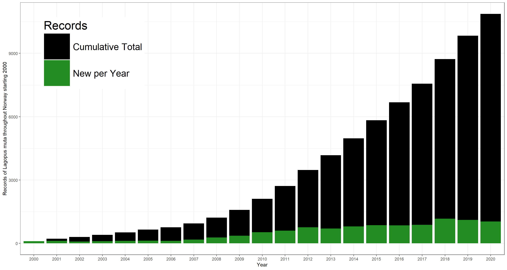

{}
<details>
  <summary>Preamble, Package-Loading, and GBIF API Credential Registering (click here):</summary>

```r
## Custom install & load function
install.load.package <- function(x) {
  if (!require(x, character.only = TRUE)) {
    install.packages(x, repos = "http://cran.us.r-project.org")
  }
  require(x, character.only = TRUE)
}
## names of packages we want installed (if not installed yet) and loaded
package_vec <- c(
  "rgbif",
  "knitr", # for rmarkdown table visualisations
  "rnaturalearth", # for shapefile access
  "sf", # for transforming polygons into wkt format
  "ggplot2", # for visualisations
  "networkD3", # for sankey plots
  "htmlwidgets", # for sankey inclusion in website
  "leaflet", # for map visualisation
  "pbapply" # for apply functions with progress bars which I use in hidden code chunks
)
## executing install & load for each package
sapply(package_vec, install.load.package)
```

```
##         rgbif         knitr rnaturalearth            sf       ggplot2     networkD3 
##          TRUE          TRUE          TRUE          TRUE          TRUE          TRUE 
##   htmlwidgets       leaflet       pbapply 
##          TRUE          TRUE          TRUE
```

```r
options(gbif_user = "my gbif username")
options(gbif_email = "my registred gbif e-mail")
options(gbif_pwd = "my gbif password")
```
</details> 
{}

First, we need to register the correct **usageKey** for *Calluna vulgaris*:

```r
sp_name <- "Calluna vulgaris"
sp_backbone <- name_backbone(name = sp_name)
sp_key <- sp_backbone$usageKey
```

With usageKey in hand, we are now ready to discover relevant data for our study needs. Doing so is a complex task mediated through rigurous metadata standards on GBIF.

{}
GBIF hosts tons of data. Finding the right subset thereof can be difficult.
{}

Data on GBIF is indexed according to the [Darwin Core Standard](https://dwc.tdwg.org/list/). Any discovery of data can be augmented by matching terms of the Darwin Core with desired subset characteristics. Here, I will show how we can build an increasingly complex query for *Calluna vulgaris* records.

At base, we will start with the functions `occc_count(...)` and `occ_search(...)`:


```r
occ_count(taxonKey = sp_key)
```

```
## [1] 882471
```

```r
occ_search(taxonKey = sp_key, limit = 0)$meta$count
```

```
## [1] 882471
```

Using both of these, we obtain the same output of $8.82471\times 10^{5}$ *Calluna vulgaris* records mediated by GBIF. Note that this number will likely be higher for you as data is continually added to the GBIF indexing and this document here is frozen in time (it was last updated on 2023-05-24).

{}
When wanting to discover data matching Darwin Core Terms with multiple characteristics, these can be fed to the `occ_search(...)` function as strings with semicolons separating desired characteristics (e.g., `year = "2000;2001"`).
{}

## Spatial Limitation
{}
By default, discovery of data through GBIF considers the entire Earth. However, that is rarely needed for specific study purposes and so it may be useful to constrain data discovery to areas of interest.
{}

### By Country Code
First, let's limit our search by a specific region. In this case, we are interested in occurrences of *Calluna vulgaris* across Norway. Countries are indexed according to ISO2 names (two-letter codes, see `enumeration_country()`):


```r
occ_NO <- occ_search(taxonKey = sp_key, country = "NO")
occ_NO$meta$count
```

```
## [1] 36503
```

Here is how *Caluna vulgaris* records are distributed across countries according to GBIF on 2023-05-24:
<details>
  <summary>Click here for code necessary to create the figure below.</summary>

```r
occ_countries <- occ_count(
  taxonKey = sp_key,
  facet = c("country"),
  facetLimit = nrow(enumeration_country())
)
occ_countries <- cbind(
  occ_countries,
  data.frame(
    GBIF = "GBIF",
    Countries = enumeration_country()$title[
      match(occ_countries$country, enumeration_country()$iso2)
    ]
  )
)
occ_countries$Records <- as.numeric(occ_countries$count)
occ_countries <- occ_countries[occ_countries$Records != 0, ]
occ_countries <- occ_countries[, -1]

plot_df <- rbind(
  occ_countries[order(occ_countries$Records, decreasing = TRUE)[1:10], -1],
  data.frame(
    GBIF = "GBIF",
    Countries = "Others",
    Records = sum(occ_countries$Records[order(occ_countries$Records, decreasing = TRUE)[-1:-10]])
  )
)
plot_df$Countries[plot_df$Countries == "United Kingdom of Great Britain and Northern Ireland"] <- "United Kingdom"
alluvial_df <- plot_df


my_color <- 'd3.scaleOrdinal() .range(["#FDE725FF","#1F9E89FF"])'

links <- alluvial_df
colnames(links) <- c("source", "target", "value")
nodes <- data.frame(
  name = c("GBIF", alluvial_df$Countries),
  group = c("a", rep("b", nrow(alluvial_df)))
)
links$IDsource <- match(links$source, nodes$name) - 1
links$IDtarget <- match(links$target, nodes$name) - 1

SN <- sankeyNetwork(
  Links = links, Nodes = nodes,
  Source = "IDsource", Target = "IDtarget",
  Value = "value", NodeID = "name",
  colourScale = my_color, NodeGroup = "group",
  sinksRight = FALSE, nodeWidth = 40, fontSize = 13, nodePadding = 5
)
networkD3::saveNetwork(network = SN, file = "SankeyCountry.html", selfcontained = TRUE)
```
</details> 
<iframe seamless width="100%" height = "600px" src="/courses/gbif/SankeyCountry.html" title="Sankey diagram of Calluna vulgaris records by country"></iframe> 

As it turns out, roughly 4.14% of *Calluna vulgaris* records mediated by GBIF fall within Norway.

### By Shapefile / Polygon

Oftentimes, you won't be interested in occurrences according to a specific country, but rather a specific area on Earth as identified through a shapefile. To demonstrate data discovery by shapefile, let's obtain the shapefile for Norway from [naturalearth](https://www.naturalearthdata.com/):


```r
NO_shp <- rnaturalearth::ne_countries(country = "Norway", scale = 110, returnclass = "sf")
```

This shapefile subsequently looks like this:

<details>
  <summary>Click here for code necessary to create the figure below.</summary>

```r
shape_leaflet <- leaflet(NO_shp) %>%
  addTiles() %>%
  addPolygons(col = "red")
saveWidget(shape_leaflet, "leaflet_shape.html", selfcontained = TRUE)
```
</details>
<iframe width="100%" height = "600px" src="/courses/gbif/leaflet_shape.html"></iframe> 

Unfortunately, `rgbif` prefers to be told about shapefiles in Well Known Text (WKT) format so we need to reformat our polygon data frame obtained above. We do so like such:

```r
NO_wkt <- st_as_text(st_geometry(NO_shp))
```

We can now pass this information into the `occ_search(...)` function using the `geometry` argument:

```r
occ_wkt <- occ_search(taxonKey = sp_key, geometry = NO_wkt)
occ_wkt$meta$count
```

```
## [1] 29070
```

Finally, we find that there are fewer records available when using the shapefile for data discovery. Why would that be? In this case, you will find that we are using a pretty coarse shapefile for Norway which probably cuts off some obersvations of *Calluna vulgaris* that do belong rightfully into Norway.

<!-- When searching for data by country code (or continent code for that matter), the returned data need not necessarily contain coordinates so long as a record is assigned to the relevant country code. While all records whose coordinates fall within a certain country are assigned the corresponding country code, not all records with a country code have coordinates attached. Additionally, the polygon defintion used by GBIF may be different to the one used by naturalearth. -->


## By Time-Frame

{}
By default, discovery of data through GBIF considers records obtained at any time. However, one may want to constrain data discovery to relevant time periods particularly when relating GBIF-mediated records to particular environmental conditions in time and space.
{}

### Single-Year
When interested in a single year or month of records being obtained, we can use the `year` and `month` arguments, respectively. Both take numeric inputs. Here, we are just looking at occurrences of *Caluna vulgaris* throughout the year 2022:

```r
occ_year <- occ_search(
  taxonKey = sp_key,
  country = "NO",
  year = 2022
)
occ_year$meta$count
```

```
## [1] 2545
```

### Time-Window
When investigating long-term trends and patterns of biodiversity, we are rarely concerned with a single year or month, but rather time-windows of data. These are also discovered using the `year` and `month` arguments. In addition to specifying strings with semicolons separating years, we can alternatively also specify a sequence of integers:

```r
occ_window <- occ_search(
  taxonKey = sp_key,
  country = "NO",
  year = 2000:2022
)
```

This returns a list of discovered data with each list element corresponding to one year worth of data. To sum up how many records are available in the time-window we thus need to run the following:

```r
sum(unlist(lapply(occ_window, FUN = function(x) {
  x$meta$count
})))
```

```
## [1] 24748
```
Using the `occ_count(...)` is easier in this example:


```r
occ_count(
  taxonKey = sp_key,
  country = "NO",
  year = "2000,2022"
)
```

```
## [1] 24748
```

Through time, the number of records develops like this:
<details>
  <summary>Click here for code necessary to create the figure below.</summary>

```r
plot_df <- data.frame(
  Year = 2000:2022,
  Records = unlist(lapply(occ_window, FUN = function(x) {
    x$meta$count
  })),
  Cumulative = cumsum(unlist(lapply(occ_window, FUN = function(x) {
    x$meta$count
  })))
)
ggplot(data = plot_df, aes(x = as.factor(Year), y = Cumulative)) +
  geom_bar(stat = "identity", aes(fill = "black")) +
  geom_bar(stat = "identity", aes(y = Records, fill = "forestgreen")) +
  theme_bw() +
  scale_fill_manual(
    name = "Records",
    values = c("black" = "black", "forestgreen" = "forestgreen"), labels = c("Cumulative Total", "New per Year")
  ) +
  theme(legend.position = c(0.15, 0.8), legend.key.size = unit(2, "cm"), legend.text = element_text(size = 20), legend.title = element_text(size = 25)) +
  labs(x = "Year", y = "Records of Caluna vulgaris throughout Norway starting 2000")
```
</details>



## By Basis of Record

{}
Records indexed by GBIF can come from multiple sources of recording. Some may be much more relevant to specific study set-ups than others.
{}

### Human Observation

First, let's look at *Caluna vulgaris* occurrences identified by human observation:

```r
occ_human <- occ_search(
  taxonKey = sp_key,
  country = "NO",
  year = 2022,
  basisOfRecord = "HUMAN_OBSERVATION"
)
occ_human$meta$count
```

```
## [1] 2543
```

These account for 99.92% of all *Caluna vulgaris* observations in Norway throughout the year 2022. So, what might be the basis of record for the remaining 2 records?

### Preserved Specimen

As it turns out, the remaining 2 records are based on preserved specimen:

```r
occ_preserved <- occ_search(
  taxonKey = sp_key,
  country = "NO",
  year = 2022,
  basisOfRecord = "PRESERVED_SPECIMEN"
)
occ_preserved$meta$count
```

```
## [1] 2
```

These are probably not very useful for many ecological applications which would rather focus on observations of specimen directly.

### Other Basis' of Record

There are additional characteristics for basis of record indexing. These are:

- "FOSSIL_SPECIMEN".
- "HUMAN_OBSERVATION".
- "MATERIAL_CITATION".
- "MATERIAL_SAMPLE".
- "LIVING_SPECIMEN".
- "MACHINE_OBSERVATION".
- "OBSERVATION".
- "PRESERVED_SPECIMEN".
- "OCCURRENCE".

Per country containing records of *Caluna vulgaris*, the data split ends up looking like this:
<details>
  <summary>Click here for code necessary to create the figure below.</summary>

```r
## query basis of record per country
basis_occ <- data.frame(basisofRecord = c(
  "FOSSIL_SPECIMEN", "HUMAN_OBSERVATION", "MATERIAL_CITATION", "MATERIAL_SAMPLE",
  "LIVING_SPECIMEN", "MACHINE_OBSERVATION", "OBSERVATION", "PRESERVED_SPECIMEN", "OCCURRENCE"
))
basis_occ <- expand.grid(basis_occ$basisofRecord, enumeration_country()$"iso2")

basis_occ$Records <- pbapply(basis_occ, MARGIN = 1, FUN = function(x) {
  occ_search(
    taxonKey = sp_key,
    country = x[2],
    basisOfRecord = x[1]
  )$meta$count
})
basis_occ$Country <- enumeration_country()$"title"[match(basis_occ$Var2, enumeration_country()$"iso2")]
basis_occ$Country[basis_occ$Country == "United Kingdom of Great Britain and Northern Ireland"] <- "United Kingdom"

## build summary data frame
links2 <- expand.grid(links$target, unique(basis_occ$Var1))
colnames(links2) <- c("source", "target")
links2$value <- 0

links2$value <- unlist(apply(links2, MARGIN = 1, FUN = function(x) {
  # print(x)
  if (x[1] == "Others") {
    aggregate(
      data = basis_occ[!(basis_occ$Country %in% nodes$name) & basis_occ$Var1 %in% as.character(x[2]), ],
      x = Records ~ 1, FUN = sum
    )
  } else {
    aggr_df <- basis_occ[basis_occ$Country %in% x[1] & basis_occ$Var1 %in% as.character(x[2]), ]
    if (nrow(aggr_df) == 0) {
      0
    } else {
      aggregate(
        data = aggr_df,
        x = Records ~ 1, FUN = sum
      )
    }
  }
}))

## build links and nodes
links_plot <- rbind(links[, 1:3], links2)
links_plot <- links_plot[links_plot$value != 0, ]

nodes_plot <- rbind(
  nodes,
  data.frame(
    name = unique(basis_occ$Var1),
    group = "c"
  )
)
nodes_plot <- nodes_plot[nodes_plot$name %in% c(links_plot$source, links_plot$target), ]

links_plot$IDsource <- match(links_plot$source, nodes_plot$name) - 1
links_plot$IDtarget <- match(links_plot$target, nodes_plot$name) - 1

## make sankey
my_color <- 'd3.scaleOrdinal() .range(["#FDE725FF","#1F9E89FF","#440154FF"])'

SN <- sankeyNetwork(
  Links = links_plot, Nodes = nodes_plot,
  Source = "IDsource", Target = "IDtarget",
  Value = "value", NodeID = "name",
  colourScale = my_color, NodeGroup = "group",
  sinksRight = FALSE, nodeWidth = 40, fontSize = 13, nodePadding = 5, margin = 2
)
networkD3::saveNetwork(network = SN, file = "SankeyBasis.html", selfcontained = TRUE)
```
</details>

<iframe seamless width="100%" height = "600px" src="/courses/gbif/SankeyBasis.html" title="Sankey diagram of Calluna vulgaris records by country and basis of record"></iframe> 

As should be plain to see from the list above, there exists some ambiguity in regards to which basis of record may apply to any single occurrence record. It is thus always best to carefully examine on which basis of record research projects should be based.

## Occurrence Status

{}
"Occurrence" records imply presence of an entity at a location in time and space. However, the GBIF-indexing of data does not constrain itself to this interpretation alone. Any data record may indicate presence or absence respectively.
{}

To avoid erroneous use of GBIF-mediated data, it is thus always necessary to be precise about what is understood by "occurrence". This can be controlled with the `ocurrenceStatus` argument.

### Present
First, we ought to look at which occurrences actually report presence of our target organism:

```r
occ_present <- occ_search(
  taxonKey = sp_key,
  country = "NO",
  year = 2022,
  basisOfRecord = "HUMAN_OBSERVATION",
  occurrenceStatus = "PRESENT"
)
occ_present$meta$count
```

```
## [1] 2543
```

Well, that is all of them.

### Absent

Therefore, we should find 0 records reporting absences given our additional limiting characteristics for data discovery:

```r
occ_absent <- occ_search(
  taxonKey = sp_key,
  country = "NO",
  year = 2022,
  basisOfRecord = "HUMAN_OBSERVATION",
  occurrenceStatus = "ABSENT"
)
occ_absent$meta$count
```

```
## [1] 0
```
That is indeed true.

Are there even any records of absences of *Caluna vulgaris*? Let's check:

```r
occ_absent <- occ_search(
  taxonKey = sp_key,
  occurrenceStatus = "ABSENT"
)
occ_absent$meta$count
```

```
## [1] 1220
```

Yes, there are, but there are far fewer reported absences than presences.

Let me visualise this one final time on a country-by-country basis:

<details>
  <summary>Click here for code necessary to create the figure below.</summary>

```r
## query basis of record per country
basis_occ <- expand.grid(
  c("PRESENT", "ABSENT"),
  c(
    "FOSSIL_SPECIMEN", "HUMAN_OBSERVATION", "MATERIAL_CITATION", "MATERIAL_SAMPLE",
    "LIVING_SPECIMEN", "MACHINE_OBSERVATION", "OBSERVATION", "PRESERVED_SPECIMEN", "OCCURRENCE"
  )
)

basis_occ$Records <- pbapply(basis_occ, MARGIN = 1, FUN = function(x) {
  occ_search(
    taxonKey = sp_key,
    basisOfRecord = x[2],
    occurrenceStatus = x[1]
  )$meta$count
})

## build summary data frame
colnames(basis_occ) <- c("target", "source", "value")

## build links and nodes
links_final <- rbind(links_plot[, 1:3], basis_occ)
links_final <- links_final[links_final$value != 0, ]

nodes_final <- rbind(
  nodes_plot,
  data.frame(
    name = unique(basis_occ$target),
    group = "d"
  )
)
nodes_final <- nodes_final[nodes_final$name %in% c(links_final$source, links_final$target), ]

links_final$IDsource <- match(links_final$source, nodes_final$name) - 1
links_final$IDtarget <- match(links_final$target, nodes_final$name) - 1

## make sankey
my_color <- 'd3.scaleOrdinal() .range(["#FDE725FF","#1F9E89FF","#440154FF", "#6b0311"])'

SN <- sankeyNetwork(
  Links = links_final, Nodes = nodes_final,
  Source = "IDsource", Target = "IDtarget",
  Value = "value", NodeID = "name",
  colourScale = my_color, NodeGroup = "group",
  sinksRight = FALSE, nodeWidth = 40, fontSize = 13, nodePadding = 5, margin = 0,
  width = 1100, height = 600
)
networkD3::saveNetwork(network = SN, file = "SankeyFinal.html", selfcontained = TRUE)
```

</a>

</details>


<iframe seamless width="100%" height = "600px" src="/courses/gbif/SankeyFinal.html" title="Sankey diagram of Calluna vulgaris records by country and basis of record and whether presence or absence is recorded"></iframe> 

**Note for Firefox users:** Sankey diagrams are contained in a viewbox which scales poorly on Firefox. You can open this webpage in a different browser to avoid this issue. Alternatively, I have included a .png of this particular diagram in the code-fold above it.

## Data Discovery Beyond Counts
The `occ_search(...)` function is useful for much more than "just" finding out how many GBIF mediated records fit your requirements.

Let me demonstrate the richness of the output returned by `occ_search(...)` with a simple example of *Calluna vulgaris* focussed on Norway:

```r
occ_meta <- occ_search(taxonKey = sp_key, country = "NO")
```

Now let's look at the structure of this object:

```r
str(occ_meta, max.level = 1)
```

```
## List of 5
##  $ meta     :List of 4
##  $ hierarchy:List of 1
##  $ data     : tibble [500 × 92] (S3: tbl_df/tbl/data.frame)
##  $ media    :List of 500
##  $ facets   : Named list()
##  - attr(*, "class")= chr "gbif"
##  - attr(*, "args")=List of 6
##  - attr(*, "type")= chr "single"
```
`occ_search(...)` returns this information:  

1. `meta` - this is the metadata which we have already used part of
2. `hierarchy` - this is the taxonomic hierarchy for the `taxonKey`(s) being queried
3. `data` - individual data records for our query (a maximum of 100,000 can be obtained per `occ_search(...)` query)
4. `media` - media metadata
5. `facets` - results can be faceted into individual lists using the `facet` argument

We will look at the downloaded data more explicitly in the next section of this workshop.

## Additional Data Discovery Considerations
The Darwin Core is large and there are many ways by which to discover different subsets of data left to explore. I leave it up to you, the reader to do so. A good place to start is the documentation for `occ_search(...)` or the documentation of the [Darwin Core](https://dwc.tdwg.org/list/) itself:

<iframe src="https://dwc.tdwg.org/list/" width="100%" height="700" data-external="1"></iframe>

{}
You are now **ready** to discover any data you require through `rgbif`. Next, you will need to learn how to actually obtain that data.
{}

## Building a Final Data Discovery Query

To facilitate the rest of this workshop, let's assume we are interested in all records of *Calluna vulgaris* across Norway which have been made by humans and found our study organism to be present between and including 2000 and 2022.

```r
occ_final <- occ_search(
  taxonKey = sp_key,
  country = "NO",
  year = "2000,2022",
  facet = c("year"), # facetting by year will break up the occurrence record counts
  year.facetLimit = 23, # this must either be the same number as facets needed or larger
  basisOfRecord = "HUMAN_OBSERVATION",
  occurrenceStatus = "PRESENT"
)
knitr::kable(t(occ_final$facet$year))
```


|      |     |     |     |     |     |     |     |     |     |     |     |     |     |     |     |     |     |     |     |     |     |     |     |
|:-----|:----|:----|:----|:----|:----|:----|:----|:----|:----|:----|:----|:----|:----|:----|:----|:----|:----|:----|:----|:----|:----|:----|:----|
|name  |2022 |2020 |2021 |2019 |2018 |2017 |2016 |2015 |2014 |2011 |2010 |2009 |2012 |2013 |2008 |2004 |2006 |2005 |2007 |2002 |2003 |2001 |2000 |
|count |2543 |2419 |2246 |1930 |1809 |1457 |1272 |1115 |1031 |932  |919  |802  |784  |752  |734  |628  |606  |437  |401  |391  |386  |378  |375  |

How many records does this return to us? Let's see:

```r
occ_count(
  taxonKey = sp_key,
  country = "NO",
  year = "2000,2022", # the comma here is an alternative way of specifying a range
  basisOfRecord = "HUMAN_OBSERVATION",
  occurrenceStatus = "PRESENT"
)
```

```
## [1] 24347
```
We could have also just summed up the facet counts, but it is good to remember this more direct function exists.

Note that we have to change the qay we sum the number of records as data discovery for any argument being matched by multiple characteristics generates an output of type list:


```r
str(occ_final, max.level = 1)
```

```
## List of 5
##  $ meta     :List of 4
##  $ hierarchy:List of 1
##  $ data     : tibble [500 × 95] (S3: tbl_df/tbl/data.frame)
##  $ media    :List of 500
##  $ facets   :List of 2
##  - attr(*, "class")= chr "gbif"
##  - attr(*, "args")=List of 10
##  - attr(*, "type")= chr "single"
```

## Session Info

```
## R version 4.3.0 (2023-04-21)
## Platform: x86_64-apple-darwin20 (64-bit)
## Running under: macOS Ventura 13.3.1
## 
## Matrix products: default
## BLAS:   /Library/Frameworks/R.framework/Versions/4.3-x86_64/Resources/lib/libRblas.0.dylib 
## LAPACK: /Library/Frameworks/R.framework/Versions/4.3-x86_64/Resources/lib/libRlapack.dylib;  LAPACK version 3.11.0
## 
## locale:
## [1] en_US.UTF-8/en_US.UTF-8/en_US.UTF-8/C/en_US.UTF-8/en_US.UTF-8
## 
## time zone: Europe/Oslo
## tzcode source: internal
## 
## attached base packages:
## [1] stats     graphics  grDevices utils     datasets  methods   base     
## 
## other attached packages:
## [1] pbapply_1.7-0       leaflet_2.1.2       htmlwidgets_1.6.2   networkD3_0.4      
## [5] ggplot2_3.4.2       sf_1.0-12           rnaturalearth_0.3.2 knitr_1.42         
## [9] rgbif_3.7.7        
## 
## loaded via a namespace (and not attached):
##  [1] gtable_0.3.3       xfun_0.39          bslib_0.4.2        lattice_0.21-8    
##  [5] vctrs_0.6.2        tools_4.3.0        crosstalk_1.2.0    generics_0.1.3    
##  [9] curl_5.0.0         parallel_4.3.0     tibble_3.2.1       proxy_0.4-27      
## [13] fansi_1.0.4        highr_0.10         pkgconfig_2.0.3    R.oo_1.25.0       
## [17] KernSmooth_2.23-20 data.table_1.14.8  lifecycle_1.0.3    R.cache_0.16.0    
## [21] farver_2.1.1       compiler_4.3.0     stringr_1.5.0      munsell_0.5.0     
## [25] htmltools_0.5.5    class_7.3-21       sass_0.4.6         yaml_2.3.7        
## [29] lazyeval_0.2.2     pillar_1.9.0       jquerylib_0.1.4    whisker_0.4.1     
## [33] ellipsis_0.3.2     R.utils_2.12.2     classInt_0.4-9     cachem_1.0.8      
## [37] styler_1.9.1       tidyselect_1.2.0   digest_0.6.31      stringi_1.7.12    
## [41] dplyr_1.1.2        purrr_1.0.1        bookdown_0.34      labeling_0.4.2    
## [45] fastmap_1.1.1      grid_4.3.0         colorspace_2.1-0   cli_3.6.1         
## [49] magrittr_2.0.3     triebeard_0.4.1    crul_1.4.0         utf8_1.2.3        
## [53] e1071_1.7-13       withr_2.5.0        scales_1.2.1       sp_1.6-0          
## [57] oai_0.4.0          rmarkdown_2.21     httr_1.4.5         igraph_1.4.2      
## [61] blogdown_1.16      R.methodsS3_1.8.2  evaluate_0.20      urltools_1.7.3    
## [65] rlang_1.1.1        Rcpp_1.0.10        httpcode_0.3.0     glue_1.6.2        
## [69] DBI_1.1.3          xml2_1.3.4         rstudioapi_0.14    jsonlite_1.8.4    
## [73] R6_2.5.1           plyr_1.8.8         units_0.8-2
```
