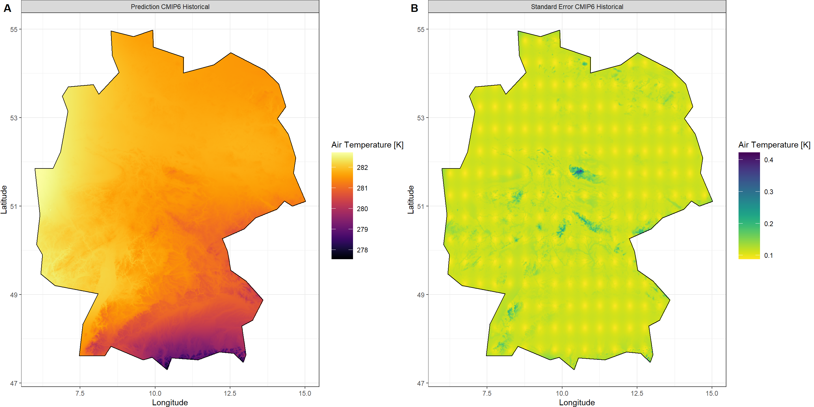

{}
This part of the workshop is dependant on set-up and preparation done previously [here](/courses/krigr/prep/).
{}

First, we load `KrigR`:


```r
library(KrigR)
```

I expect that you will often be interested not just in past and current climatic conditions, but also in future projections of climate data at high spatial resolutions.

{}
The `KrigR` workflow can be used to establish high-resolution, bias-corrected climate projection products.
{}

This time, we run our exercise for all of Germany because of its size and topographical variety.


```r
Shape_shp <- ne_countries(country = "Germany")
```

## `KrigR` Process for Projections

We published the the `KrigR` workflow for downscaled climate projections in [this publication (Section 3.5)](https://iopscience.iop.org/article/10.1088/1748-9326/ac48b3) and I will walk you through the contents thereof here.

To achieve downscaled projection products we require three data products:  
1. Historical climate data from ERA5(-Land)  
2. Historical climate data from projection source  
3. Future climate data from projection source  


Subsequently, the data products are downscaled to the desired spatial resolution using `krigR()`. Finally, the difference between the downscaled projection-sourced data are added to the historical baseline obtained from (downscaled) ERA5(-Land) data. This achieves bias correction.

### Obtaining ERA5(-Land) Data

Now, let's obtain the historical baseline from ERA5-Land for the same time-period as our CMIP6 historical data.

<details>
  <summary>Click here for file if download takes too long:</summary>
    Download 
<a href="https://github.com/ErikKusch/Homepage/raw/master/content/courses/krigr/Data/Germany_Hist_ERA.nc">Germany_Hist_ERA.nc</a> and place it into your data directory.
</details> 


```r
if(!file.exists(file.path(Dir.Data, "Germany_Hist_ERA.nc"))){
  Hist_ERA_ras <- download_ERA(Variable = "2m_temperature",
                               DateStart = "1981-01-01",
                               DateStop = "1999-12-31",
                               TResolution = "month",
                               TStep = 1,
                               Extent = Shape_shp,
                               Dir = Dir.Data,
                               FileName = "Germany_Hist_ERA", 
                               API_Key = API_Key,
                               API_User = API_User,
                               SingularDL = TRUE)
  Index <- rep(1:12, length = nlayers(Hist_ERA_ras))
  Hist_ERA_ras <- stackApply(Hist_ERA_ras, indices = Index, fun = mean)
  writeRaster(Hist_ERA_ras, filename = file.path(Dir.Data, "Germany_Hist_ERA"), format = "CDF")
}
Hist_ERA_ras <- mean(stack(file.path(Dir.Data, "Germany_Hist_ERA.nc")))
```

### Obtaining Projection Data

Here, we use CMIP6 projection data manually sourced from the [ECMWF CDS distribution](https://cds.climate.copernicus.eu/cdsapp#!/dataset/projections-cmip6?tab=overview).

{}
Our [development goals](/courses/krigr/outlook/) include development of `download_ERA()` to work with other ECWMF CDS data sets aside from ERA5(-Land). This includes this CMIP6 data set.
{}

#### Historical Baseline

<details>
  <summary>Click here for file:</summary>
    Download 
<a href="https://github.com/ErikKusch/Homepage/raw/master/content/courses/krigr/Data/historical_tas_1981-2000.nc">historical_tas_1981-2000.nc</a> and place it into your data directory.
</details> 


```r
train_HIST <- mean(stack(file.path(Dir.Data, "historical_tas_1981-2000.nc")))
train_HIST <- crop(train_HIST,extent(Hist_ERA_ras))
train_mask <- KrigR::mask_Shape(train_HIST, Shape_shp)
train_HIST <- mask(train_HIST, train_mask)
```

#### Future Projection

<details>
  <summary>Click here for file:</summary>
    Download 
<a href="https://github.com/ErikKusch/Homepage/raw/master/content/courses/krigr/Data/ssp585_tas_2041-2060.nc">ssp585_tas_2041-2060.nc</a> and place it into your data directory.
</details> 


```r
train_SSP <- mean(stack(file.path(Dir.Data, "ssp585_tas_2041-2060.nc")))
train_SSP <- crop(train_SSP,extent(Hist_ERA_ras))
train_mask <- KrigR::mask_Shape(train_SSP, Shape_shp)
train_SSP <- mask(train_SSP, train_mask)
```

#### Visualisation of CMIP6 Data

```r
Plot_Raw(stack(train_HIST, train_SSP), 
         Shp = Shape_shp,
         Dates = c("Historic CMIP6", "Future CMIP6"))
```


Already, we can see that quite a bit of warming is projected to happen all across Germany. However, we want to know about this at higher spatial resolutions. That's where `KrigR` comes in.

### Establishing Kriged Products

For the first time in this workshop material, we will push our spatial resolution to the finest scale supported by our default GMTED 2010 DEM covariate data: 0.008333 / ~1km.

{}
These operations take quite some time - grab a tea or coffee, go for a walk, or stretch a bit.
{}

The downscaling calls should be familiar by now so I will forego explaining them. In case, the following code snippets do not make sense to you, please consult the portion of this workshop concerned with [statistical downscaling](/courses/krigr/kriging/).

#### Historical CMIP6

```r
## Covariate Data
GMTED_DE <- download_DEM(
  Train_ras = train_HIST,
  Target_res = 0.008334,
  Shape = Shape_shp,
  Keep_Temporary = TRUE,
  Dir = Dir.Covariates
)
## Kriging
Output_HIST <- krigR(
  Data = train_HIST,
  Covariates_coarse = GMTED_DE[[1]], 
  Covariates_fine = GMTED_DE[[2]],  
  Keep_Temporary = FALSE,
  Cores = 1,
  Dir = Dir.Exports,  
  FileName = "DE_CMIP-HIST", 
  nmax = 40
)
```


```r
Plot_Krigs(Output_HIST,
           Shp = Shape_shp,
           Dates = "CMIP6 Historical", columns = 2)
```



#### Future CMIP6

```r
## Covariate Data
GMTED_DE <- download_DEM(
  Train_ras = train_SSP,
  Target_res = 0.008334,
  Shape = Shape_shp,
  Keep_Temporary = TRUE,
  Dir = Dir.Covariates
)
## Kriging
Output_SSP <- krigR(
  Data = train_SSP,
  Covariates_coarse = GMTED_DE[[1]], 
  Covariates_fine = GMTED_DE[[2]],   
  Keep_Temporary = FALSE,
  Cores = 1,
  Dir = Dir.Exports,  
  FileName = "DE_SSP585_2041-2060", 
  nmax = 40
)
```


```r
Plot_Krigs(Output_SSP,
           Shp = Shape_shp,
           Dates = "CMIP6 Future", columns = 2)
```


#### Historical ERA5-Land

```r
## Covariate Data
GMTED_DE <- download_DEM(
  Train_ras = Hist_ERA_ras,
  Target_res = 0.008334,
  Shape = Shape_shp,
  Keep_Temporary = TRUE,
  Dir = Dir.Covariates
)
## Kriging
Output_ERA <- krigR(
  Data = Hist_ERA_ras,
  Covariates_coarse = GMTED_DE[[1]], 
  Covariates_fine = GMTED_DE[[2]],   
  Keep_Temporary = FALSE,
  Cores = 1,
  Dir = Dir.Exports,  
  FileName = "DE_hist", 
  nmax = 40
)
```


```r
Plot_Krigs(Output_ERA,
           Shp = Shape_shp,
           Dates = "ERA5-Land Historical", columns = 2)
```


### Putting It All Together

To establish a final product of high-resolution climate projection data, we simply add the difference between the kriged CMIP6 products to the kriged ERA5-Land product:


```r
## Creating Difference and Projection raster
Difference_ras <- Output_SSP[[1]] - Output_HIST[[1]]
Projection_ras <- Output_ERA[[1]] + Difference_ras
## Adding min and max values to ocean cells to ensure same colour scale
Output_ERA[[1]][10] <- maxValue(Projection_ras)
Output_ERA[[1]][12] <- minValue(Projection_ras)
Projection_ras[10] <- maxValue(Output_ERA[[1]])
Projection_ras[12] <- minValue(Output_ERA[[1]])
## Individual plots
A_gg <- Plot_Raw(Output_ERA[[1]], Shp = Shape_shp, 
                 Dates = "Historical ERA5-Land (1981-2000)")
B_gg <- Plot_Raw(Difference_ras[[1]], Shp = Shape_shp, 
                 Dates = "Anomalies of SSP585 - Historical CMIP-6",
                 COL = rev(viridis(100)))
C_gg <- Plot_Raw(Projection_ras[[1]], Shp = Shape_shp, 
                 Dates = "Future Projection (ERA5-Land + Anomalies)")
## Fuse the plots into one big plot
ggPlot <- plot_grid(plotlist = list(A_gg, B_gg, C_gg), 
                    ncol = 3, labels = "AUTO") 
ggPlot
```


And there we have it - a downscaled, bias-corrected projection of air temperature across Germany.

## Considerations for Projection Kriging

Projection kriging is easily the most flexible exercise you can undertake with `KrigR`. 

{}
I have submitted a research proposal to establish best practice for projection kriging.
{}

So far, two particular aspects stand out to me and should be considered by you when using `KrigR` to obtain high-resolution projection data.

{}
**Do not statistically downscale precipitation data and do not use products that do so!**
{}

### Reliability

Just like with all statistical downscaling exercises, it is pivotal to consider variables interpolated and consistency of statistical relationships with covariates across spatial resolutions.

{}
Kriging is a very flexible tool for statistical interpolation. Consider your choice of covariates and change in resolutions carefully. **Always inspect your data**.
{}

### Uncertainty

Integration of multiple kriged data sets with statistical uncertainty and each of which comes with its own underlying dynamical data uncertainty raises the question of how to combine uncertainties for meaningful uncertainty flags.

{}
I have submitted a research proposal to assess best practice for uncertainty integration across data products.
{}

## Session Info

```r
sessionInfo()
```

```
## R version 4.2.3 (2023-03-15)
## Platform: x86_64-apple-darwin17.0 (64-bit)
## Running under: macOS Big Sur ... 10.16
## 
## Matrix products: default
## BLAS:   /Library/Frameworks/R.framework/Versions/4.2/Resources/lib/libRblas.0.dylib
## LAPACK: /Library/Frameworks/R.framework/Versions/4.2/Resources/lib/libRlapack.dylib
## 
## locale:
## [1] en_US.UTF-8/en_US.UTF-8/en_US.UTF-8/C/en_US.UTF-8/en_US.UTF-8
## 
## attached base packages:
## [1] parallel  stats     graphics  grDevices utils     datasets  methods   base     
## 
## other attached packages:
##  [1] mapview_2.11.0          rnaturalearthdata_0.1.0 rnaturalearth_0.3.2    
##  [4] gimms_1.2.1             ggmap_3.0.2             cowplot_1.1.1          
##  [7] viridis_0.6.2           viridisLite_0.4.1       ggplot2_3.4.1          
## [10] tidyr_1.3.0             KrigR_0.1.2             terra_1.7-21           
## [13] httr_1.4.5              stars_0.6-0             abind_1.4-5            
## [16] fasterize_1.0.4         sf_1.0-12               lubridate_1.9.2        
## [19] automap_1.1-9           doSNOW_1.0.20           snow_0.4-4             
## [22] doParallel_1.0.17       iterators_1.0.14        foreach_1.5.2          
## [25] rgdal_1.6-5             raster_3.6-20           sp_1.6-0               
## [28] stringr_1.5.0           keyring_1.3.1           ecmwfr_1.5.0           
## [31] ncdf4_1.21             
## 
## loaded via a namespace (and not attached):
##  [1] leafem_0.2.0             colorspace_2.1-0         class_7.3-21            
##  [4] leaflet_2.1.2            satellite_1.0.4          base64enc_0.1-3         
##  [7] rstudioapi_0.14          proxy_0.4-27             farver_2.1.1            
## [10] fansi_1.0.4              codetools_0.2-19         cachem_1.0.7            
## [13] knitr_1.42               jsonlite_1.8.4           png_0.1-8               
## [16] Kendall_2.2.1            compiler_4.2.3           assertthat_0.2.1        
## [19] fastmap_1.1.1            cli_3.6.0                htmltools_0.5.4         
## [22] tools_4.2.3              gtable_0.3.1             glue_1.6.2              
## [25] dplyr_1.1.0              Rcpp_1.0.10              jquerylib_0.1.4         
## [28] vctrs_0.6.1              blogdown_1.16            crosstalk_1.2.0         
## [31] lwgeom_0.2-11            xfun_0.37                timechange_0.2.0        
## [34] lifecycle_1.0.3          rnaturalearthhires_0.2.1 zoo_1.8-11              
## [37] scales_1.2.1             gstat_2.1-0              yaml_2.3.7              
## [40] curl_5.0.0               memoise_2.0.1            gridExtra_2.3           
## [43] sass_0.4.5               reshape_0.8.9            stringi_1.7.12          
## [46] highr_0.10               e1071_1.7-13             boot_1.3-28.1           
## [49] intervals_0.15.3         RgoogleMaps_1.4.5.3      rlang_1.1.0             
## [52] pkgconfig_2.0.3          bitops_1.0-7             evaluate_0.20           
## [55] lattice_0.20-45          purrr_1.0.1              htmlwidgets_1.6.1       
## [58] labeling_0.4.2           tidyselect_1.2.0         plyr_1.8.8              
## [61] magrittr_2.0.3           bookdown_0.33            R6_2.5.1                
## [64] generics_0.1.3           DBI_1.1.3                pillar_1.8.1            
## [67] withr_2.5.0              units_0.8-1              xts_0.13.0              
## [70] tibble_3.2.1             spacetime_1.2-8          KernSmooth_2.23-20      
## [73] utf8_1.2.3               rmarkdown_2.20           jpeg_0.1-10             
## [76] grid_4.2.3               zyp_0.11-1               FNN_1.1.3.2             
## [79] digest_0.6.31            classInt_0.4-9           webshot_0.5.4           
## [82] stats4_4.2.3             munsell_0.5.0            bslib_0.4.2
```
