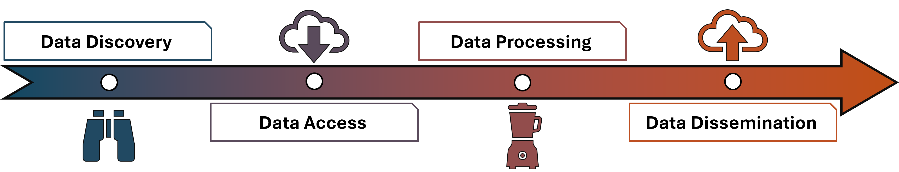

{}
`ClimHub` is still in in development and I continue to add to its functionality and broaden its scope. 
<!-- For any suggestions of development goals, novel functionality as well as any issues you might face with `ClimHub`, please register an issue on <a href="https://github.com/Clim-Hub/ClimHub/issues" target="_blank">GitHub</a>. where I track these issues. Please refrain from inquiries via direct E-mail. -->
{}

# Motivation
 
I developed `ClimHub` to address a recurring challenge in my work with climate data: the lack of a unified, efficient, and reproducible workflow for accessing and processing heterogeneous climate datasets. Working with climate data often involves navigating multiple repositories, formats (e.g., NetCDF), and inconsistent preprocessing steps, which leads to duplicated effort and fragile, hard-to-reproduce scripts.

I want a solution that would reduce this overhead by standardising common tasks—such as data acquisition, formatting, and spatial handling—while remaining flexible enough to support different research questions and data sources. `ClimHub` emerges from the need to simplify these workflows, improve reproducibility, and make climate data more readily usable for both exploratory and large-scale analyses.

# Description

`ClimHub` is an open-source, modular toolbox designed to support the full climate data workflow—from finding relevant datasets to preparing and sharing outputs. It provides a structured yet flexible framework that integrates common operations into a unified pipeline.

Concretely, `ClimHub` supports the entire data lifecycle structured around:

1. **Data Discovery**  
Identify and explore relevant climate datasets across multiple sources. `ClimHub` streamlines the process of locating appropriate data products by providing interfaces to query and navigate distributed climate data repositories.
2. **Data Access**  
Retrieve climate data efficiently from remote services. This includes handling different protocols and formats and automating data acquisition steps that would otherwise require manual intervention or custom scripts.
3. **Data Processing**  
Transform raw climate data into analysis-ready formats. `ClimHub` supports tasks such as subsetting, regridding, temporal aggregation, and spatial operations, while leveraging established `R`-based geospatial tools. It also facilitates scalable workflows, including parallel processing, to handle large datasets efficiently.
4. **Data Dissemination**  
Prepare and share processed data and outputs in a reproducible manner. `ClimHub` helps structure outputs so they can be reused, communicated, or integrated into downstream analyses and applications, supporting transparent and reproducible research practices.

Overall, `ClimHub` acts as an end-to-end climate data hub, reducing the technical overhead associated with working across disparate tools and enabling a more streamlined, reproducible, and scalable approach to climate data analysis. Users are be able to start the process of the `ClimHub` workflow at any given function of the package, but it is recommended to let `ClimHub` handle the entire workflow as intended.