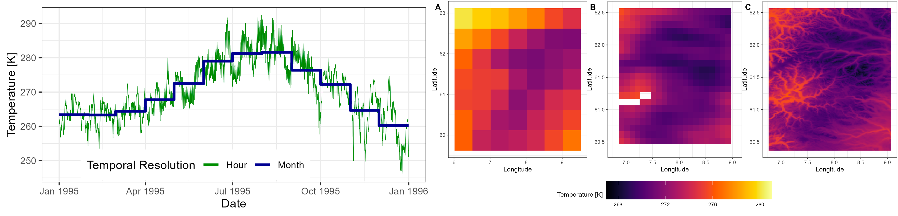
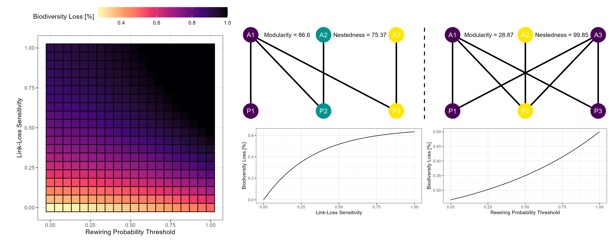
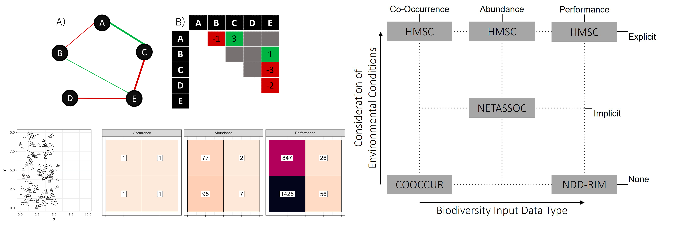

My PhD project was a part of the greater [BIORATES](/project/biorates/) project.

# Motivation

Species rarely occur in isolation. Instead, they assemble into multi-species communities wherein individuals interact within and across species groups. These pairwise species interactions affect responses of biological communities to environmental conditions and perturbations. To understand and forecast changes within the Ecosphere, it is thus vital to quantify such interactions and explore their implications. Changes in pairwise species interactions are largely spurred by processes of the Anthropocene (e.g., changes in temperature, habitat availability). These affect entire ecosystems simultaneously thus necessitating the exploration of biological interactions at macroecological scales. Despite the complexity of biological interactions and the networks they form at macroecological scales, their study can be carried out readily via ecological networks.

Here, I develop methodology and carry out analyses to address (1) the failure of contemporary macroecological research to incorporate state-of-the-art climate data by updating macroecological research practices, (2) the implications of mechanisms of extinction cascades within ecological networks with respect to interaction magnitude and potential/realised interactions thus using ecological networks as forecast tools, and finally (3) the lack of ecological network quantification at macroecological scales by inferring biological interactions from proxies.

# Work Packages

## Chapter 1 - Updating Macroecological Research Practices
Environmental conditions which regulate species distributions determine whether pairwise biological interactions can be realised (i.e., species which do not coincide cannot directly interact). Furthermore, changes in abiotic conditions alter the expression of realised interactions. Therefore, it is crucial to explicitly consider environmental conditions when quantifying and forecasting biological interactions, particularly at macroecological scales which are characterized by prominent environmental heterogeneity (e.g. thermal gradients). However, macroecological research, at present, does not leverage the most recent and accurate climate data products available. Therefore, we require changes to macroecological research practices to integrate state-of-the-art climate data.

To resolve this issue, I have developed the `KrigR` `R` package which provides an easy-to-use and highly flexible infrastructure for access, temporal aggregation, spatial limitation, and statistical downloading of state of the art climate data from ECMWF. The resulting data products outperform legacy data products commonly used in macroecological research in (1) temporal resolution, (2) data accuracy, (3) provisioning of climate variables, (4) flexibility, and (5) applicability to specific research requirements.

This work has been published in [Kusch & Davy, 2022](/publication/krigr-a-tool-for-statistically-downscaling-climate-reanalysis-data-for-ecological-applications/) and [Davy & Kusch, 2021](/publication/reconciling-high-resolution-climate-datasets-using-krigr/). Due to the ongoing development of `KrigR`, I have transferred any ongoing work on these issues to the [`KrigR` project](/project/krigr/)

## Chapter 2 - Using Ecological Networks as Forecast Tools
Biological interactions range in identity (i.e, present, absent), sign (i.e., positive and negative), and magnitude which determine the importance of an interaction for the persistence of interacting species and entire communities. This impact manifests especially through extinction cascades which exacerbate the biodiversity loss and change of network topologies spurred by Anthropogenic impacts. Such cascades are characterized by the loss of biological interactions following the extinction of a species leading to additional species extinctions. Thus, to forecast future community structures and quantify risk to ecosystem stability and functioning, it is vital to consider both the potential for and sign as well as magnitude of species interactions. Flexible and easy-to-use methodology for this purpose is currently lacking. Consequently, exploration of extinction cascades has remained simplistic and ought to be updated to facilitate the exploration of realistic future scenarios of the Ecosphere.

In addressing this knowledge gap, I have co-developed the `NetworkExtinction` `R` package which enables simulations of extinction cascades within trophic as well as mutualistic networks with varying levels of link-importance and realisation of potential interactions. Using this tool, I subsequently explore network resilience landscapes defined by link-loss sensitivity and rewiring probability thresholds for a collection of empirical mutualistic networks across the Earth.

The `NetworkExtinction` package is currently under review as [Ávila-Thieme & Kusch et. al](/publication/networkextinction-an-r-package-to-simulate-extinctions-propagation-and-rewiring-potential-in-ecological-networks/) while the exploration of mutualistic network resilience landscapes (Kusch & Ordonez) is currently being prepared for submission.

## Chapter 3 - Inferring Biological Interactions from Proxies
Ecological networks are affected by the scales (e.g., local, regional, and continental) at which they are represented. Thus, locally quantified biological interactions cannot be used reliably to represent macroecological processes. However, sourcing networks at macroecological scales via traditional in-situ observations is prohibitively labour-intensive thus requiring the inference of biological interactions from macroecological proxies. However, the accuracy of already established biological interaction inference approaches remains understudied, calling into question their utility. Therefore, consistency and performance of interaction inference ought to be evaluated for use at macroecological scales.

Within this final chapter of my PhD, I assess the consistency of four different interaction inference approaches (COOCCUR, NETASSOC, HMSC, and NDD-RIM) across ecologically relevant skills. Finding little consistency between the inferred ecological networks, I subsequently develop a demographic simulation framework of populations of interactiong species across time and space and establish guidelines for assessment of ecological network inference performance.

While the study of inference consistency is already submitted for review as [Kusch et. al, 2022](/publication/ecological-network-inference-is-not-consistent-across-sales-or-approaches/), a publication of Kusch & Vinton, Ordonez is to follow presenting the simulation framework.

# Implications

To ensure ecosystem management and conservation efforts are targeted appropriately under climate change, my work highlights that macroecological research practices ought to undergo a paradigm shift away from one-size-fits-all climate datasets towards reproducible and flexible data workflows for generation of climate datasets with respect to specific study purposes and requirements. Additionally, my explicit integration of ecological network resilience mechanisms towards extinction cascades reveals that contemporary approaches are likely overly optimistic in their projections of biodiversity loss throughout the Anthropocene. Lastly, I caution against naive use of ecological network inference within macroecological research. Instead, to render knowledge of ecological networks at macroecological scales, I argue that extensive assessments of network inference performance are required for which I present important groundwork.

Ultimately, my dissertation represents a key advancement of use-cases of ecological networks at macroecological scales. Thus, adopting the novel methodology I have developed for macroecological use and inference of ecological networks is pressing in order to ensure adequate ecosystem management throughout the Anthropocene. 